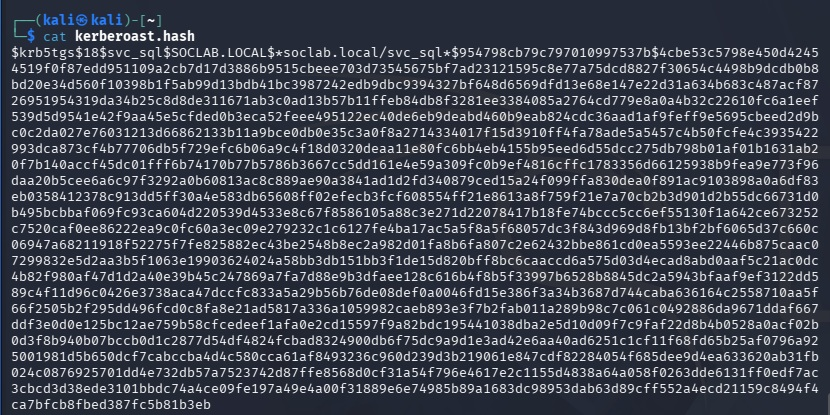
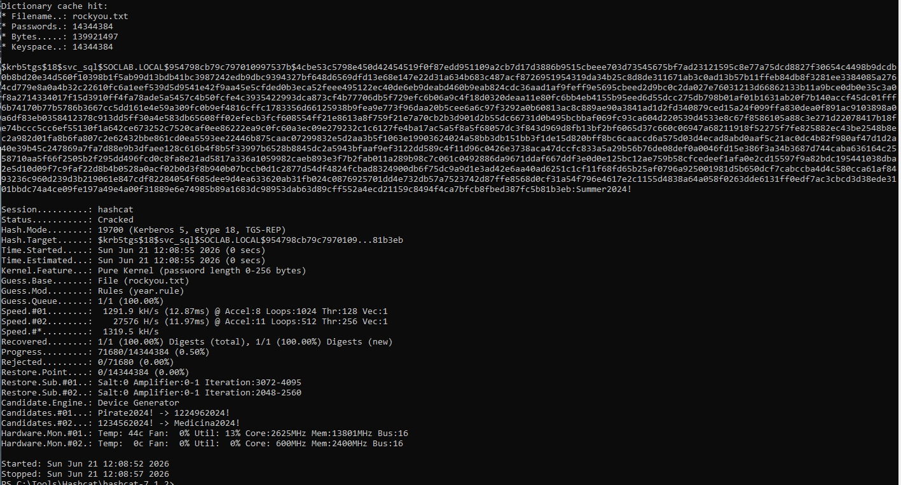
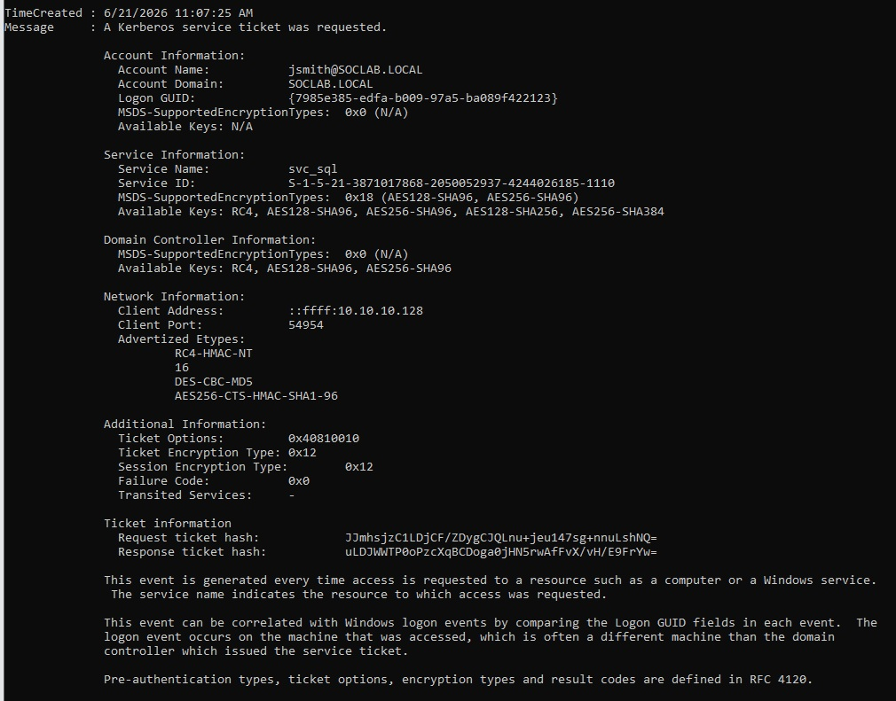
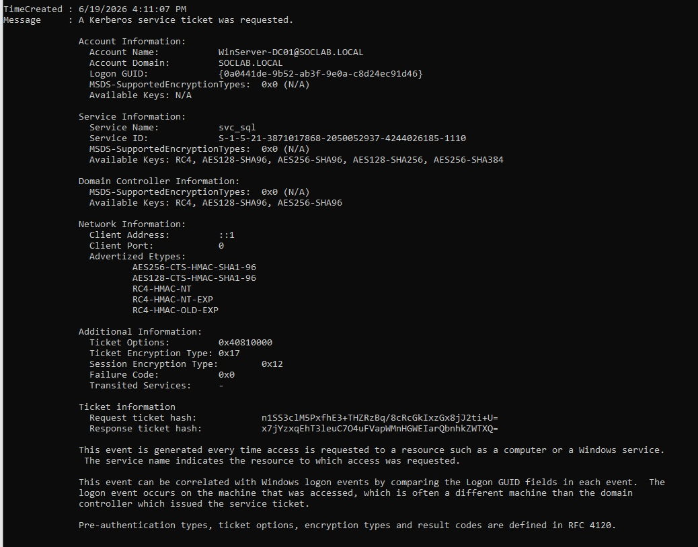
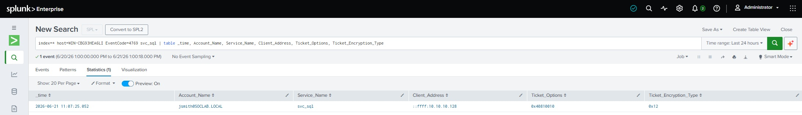
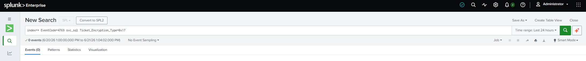
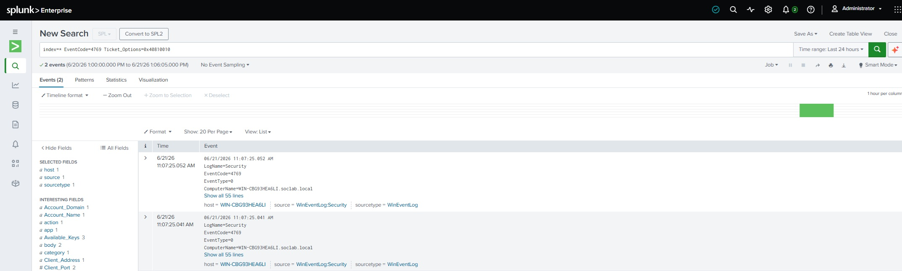
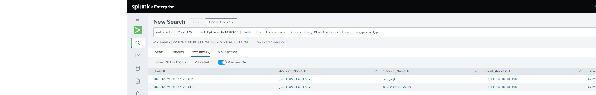
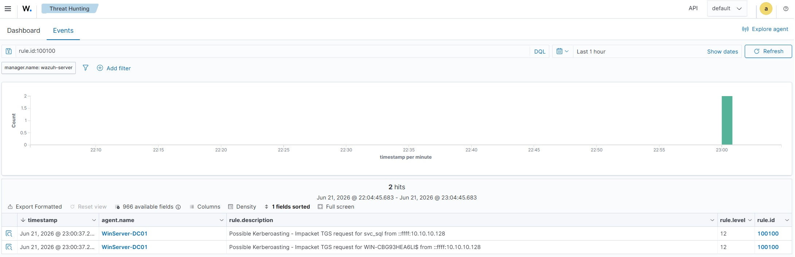

# Kerberoasting an AES-Only Domain — and the Two SIEMs That Nearly Got Away With Ignoring It

*Part of an ongoing detection-engineering series — each entry takes one intrusion technique end to end through two SIEMs. This one is Kerberoasting, the credential-access move an attacker reaches for after gaining a foothold in the domain.*

**Completed:** 2026-06-21
**Author:** Malakh Fuller

**Privacy note:** Internal lab IP addresses have been anonymized in this writeup and related screenshots. All testing was performed exclusively on my own isolated home lab network, against accounts I created specifically to be attacked.

**How to read this:** This is the honest version, and this one earns the label. The attack and the crack went fast. The detection engineering — the Wazuh half in particular — was a multi-hour fight with wrong turns, false leads, and a long stretch where I was nearly convinced a clean event had vanished into thin air. All of it is in here on purpose. A writeup where the custom rule fires on the first try is a writeup where nothing was actually learned. The dead ends *are* the experience; they're the part I can defend in an interview, because I lived every one of them.

**On AI:** As with the rest of this series, I used Claude as a research and troubleshooting partner — and on this exercise it was a working partner more than on any build before it. When the Wazuh rule refused to fire, the two of us bisected the problem together: it proposed the next probe, I ran it and fed back the result, and we narrowed the fault one layer at a time. The division of labor is the same one I'll stand behind in any room: every command was one I ran, every wall was one I hit myself, every judgment call — when to push, when to bank, when a confident-sounding fix didn't smell right — was mine, and more than once I was the one who pushed back on a theory that turned out to be wrong. Every claim here I can defend with the tab closed. I'd have reached the same working rule without AI; it would simply have cost me days of forum threads instead of an evening. In a field where the ground shifts weekly, that's a trade I'll take every time. The carpenter who refuses power tools still builds the house — it just takes him longer, and fewer people line up to hire him.

---

## Objective

Take the dual-SIEM lab from Phase 2 and use it for what it was built for: run a real attack through it and find out whether either SIEM actually catches it.

The attack is Kerberoasting (MITRE ATT&CK [T1558.003](https://attack.mitre.org/techniques/T1558/003/)) — any authenticated domain user can request a service ticket and crack it offline for the service account's password, no privilege escalation required to start. But my domain controller runs Windows Server 2025, which has finished retiring RC4, and the target service account is set AES-only. That single fact bends the whole exercise: the published attack and nearly every published detection are written for the RC4 world, and neither survives contact with a hardened, AES-only domain unchanged.

Concretely, the goals:

- **Execute the roast** against the AES-only account, working *around* the RC4 wall instead of pretending it isn't there.
- **Crack the recovered AES256 ticket** and prove what the cipher upgrade did and didn't buy the defender.
- **Hunt the attack in both SIEMs** and demonstrate, in real data, why the textbook RC4 signature is blind to it and what behavioral detection catches instead.
- **Hand-write a working Kerberoasting rule in Wazuh** — the deliverable — and validate it end to end.

The goal was never a tutorial-to-a-working-screenshot. It was to confront the current reality (RC4 is dying, and the detections everyone copies haven't caught up) and to understand the telemetry well enough to build detection that holds up on a domain that looks like 2026, not 2019.

## Tools and Technologies

| Category | Details |
| --- | --- |
| Attack tooling | Impacket (`getTGT`, `GetUserSPNs`) on Kali Linux 2026.1 |
| Hash cracking | Hashcat 7.1.2 (mode 19700, AES256 Kerberos), rockyou + a custom mutation rule, NVIDIA RTX 5070 Ti (host GPU) |
| SIEM #1 (rule-driven) | Wazuh 4.14 — custom rule authoring in `local_rules.xml`, decoder and rule-chain analysis |
| SIEM #2 (index-everything) | Splunk Enterprise 10.4.0 — SPL, behavioral vs. signature searches |
| Target | Windows Server 2025 domain controller, AD DS `soclab.local`, AES-only service account (RC4 disabled) |
| Telemetry | Windows Security Event 4769, Sysmon v15.20, Wazuh `windows_eventchannel` decoder |
| Technique | MITRE ATT&CK T1558.003 — Kerberoasting |
| Skills applied | Kerberos/AD attack flow, offline hash cracking, SPL, Wazuh rule engineering (XML, `if_sid` chains, field matching), behavioral vs. signature detection, multi-source log corroboration, MITRE mapping |
| Prior knowledge | CompTIA A+, Network+, Security+, CySA+ (in progress), prior home SOC labs |

## Environment (the machines in play)

| VM | Role in this exercise | IP |
| --- | --- | --- |
| Kali-AttackBox | Attacker — low-privilege user `jsmith` | 10.10.10.128 |
| WinServer-DC01 (`WIN-CBG93HEA6LI`) | Server 2025 DC — target *and* telemetry source | 10.10.10.134 |
| WazuhServer-SIEM01 | SIEM #1 — Wazuh 4.14 | 10.10.10.130 |
| Splunk-SIEM02 | SIEM #2 — Splunk Enterprise 10.4.0 | 10.10.10.137 |

*The full seven-VM roster and network architecture live in the Phase 2 buildout writeup; the four machines above are the ones in play here.*

## Coming in

This sits directly on the Phase 2 dual-SIEM buildout. By the time this exercise starts, the lab already has:

- **Both SIEMs collecting the same Windows Security and Sysmon telemetry from the DC** — Wazuh via its agent, Splunk via a Universal Forwarder. Two independent pipes on one source, which turns out to matter more than I expected.
- **A Server 2025 domain, `soclab.local`,** with a service account `svc_sql` carrying an SPN (`MSSQLSvc/sql01.soclab.local:1433`) and hardened to AES-only — the deliberate condition this whole exercise is built around.
- **An ordinary domain user, `jsmith`,** standing in for the low-privilege foothold a real attacker would start from.

One carried-forward gotcha that bites again here: the DC's real computer name is the auto-generated `WIN-CBG93HEA6LI`, not its friendly VM label. Splunk keys on the real name, so searching the label returns nothing — an old lesson that resurfaces the moment I start hunting.

---

## The tutorial I couldn't use

Every Kerberoasting walkthrough I'd read was written for a domain that doesn't quite exist anymore. They all open the same way: ask the domain controller for a service ticket, get an RC4-encrypted hash back, crack it offline at a billion guesses a second. Clean, fast, very 2019.

My DC runs Windows Server 2025. The first thing it did when I pointed Impacket at a service account was refuse to hand over the RC4 ticket the tutorial promised. Modern AD has been quietly walking away from RC4 for years, and Server 2025 finishes the job — the account I was targeting was set to AES-only. So before I'd cracked anything, the lab had already handed me the thing that makes this worth writing about: **the published attack and the published detection are both calibrated to a cipher the operating system is actively retiring.** Follow either one to the letter against a current domain and you get a surprise.

I want to be upfront about where I'm coming from, because it shapes how I worked the rest of this. I'm new to the tools — the certs are fresh, and I'm still developing the hands-on skills. What I'm not new to is the analytical half of this job. I spent two decades in competitive intelligence, and the part I owned wasn't the gathering, it was the *evaluation*: take what a researcher brought back, push on it, make them confirm the detail, get the same fact from a second and ideally a third independent source before it ever went into a client briefing. You learn not to trust a single report. That instinct turned out to be the only thing that got me through the back half of this exercise, where the tool said one thing, the dashboard said another, and the truth was sitting in a log file neither of them was showing me.

Here's the whole arc up front, then the long version: I roasted an AES service ticket, cracked it in seconds, and proved the cipher upgrade bought the defender almost nothing — because the real weakness was a human-chosen password. Then I tried to catch the attack in both my SIEMs. Splunk caught it the moment I stopped watching the cipher and started watching the tool. Wazuh caught nothing at all — and tried to convince me for hours that the attack had never even arrived. If Splunk hadn't detected it already, I would have doubted it happened. Ultimately, I had to stop trusting the Wazuh dashboard and go to the source.

---

## The attack: roasting in a world that hates RC4

The target was a SQL service account, `svc_sql`, with an SPN of `MSSQLSvc/sql01.soclab.local:1433`. The attacker was an ordinary domain user, `jsmith` — no admin rights, no special access. That's the whole point of Kerberoasting (MITRE [T1558.003](https://attack.mitre.org/techniques/T1558/003/)): any authenticated user can ask the DC for a service ticket, and the ticket is encrypted with a key derived from the service account's password. Get the ticket, crack it offline, and you have the password — no privilege escalation required to start.

The standard one-liner is `impacket-GetUserSPNs` with a username and password. Against Server 2025, that immediately ran into the AES wall: the modern flow wants a Kerberos ticket-granting ticket (TGT) in hand before it'll cleanly request the service ticket, rather than negotiating an RC4 downgrade the DC will just reject. So the attack became two steps instead of one.

First, mint a TGT for `jsmith` and stash it in a credential cache:

```bash
impacket-getTGT soclab.local/jsmith:'SOC-lab2026' -dc-ip 10.10.10.134
# [*] Saving ticket in jsmith.ccache
```

Then roast `svc_sql` using that cached ticket for authentication (`-k -no-pass`) instead of a password:

```bash
KRB5CCNAME=jsmith.ccache impacket-GetUserSPNs -k -no-pass \
  -dc-ip 10.10.10.134 -request \
  -outputfile kerberoast.hash soclab.local/jsmith
```

The `-k -no-pass` is the move that walks past the RC4 wall — it authenticates with the Kerberos ticket I just minted instead of forcing the legacy downgrade the DC refuses. The `-request` flag is the one doing the real work: it actually requests the service ticket for `svc_sql`'s SPN, which is the action that fires the telemetry I'd later be hunting. Without it you get a directory listing and no ticket, no roast, no event.

The hash came back beginning `$krb5tgs$18$`. That `18` matters: it's the encryption-type number for AES256. The 2019 tutorials produce a `$krb5tgs$23$` — type 23, RC4. I had an AES roast, which meant the easy crack was off the table and the easy *detection* was about to be off the table too.


*The recovered ticket — `$krb5tgs$18$`. The `18` is AES256; every 2019 tutorial produces a `$krb5tgs$23$` (RC4). The cipher alone tells you the easy path is gone.*

---

## The crack: the cipher was never the control

I moved the hash to my host (an RTX 5070 Ti) for cracking, because AES Kerberos tickets are deliberately expensive to brute-force and the GPU changes "overnight grind" into "coffee's not done yet." I ran two passes on purpose, because the contrast between them *is* the lesson.

**Pass one — a straight dictionary, rockyou, the honest first try:**

```bash
hashcat -m 19700 -a 0 kerberoast.hash rockyou.txt
# Status: Exhausted   Recovered: 0/1
```

Mode `19700` is AES256 Kerberos. All 14,344,384 rockyou words, zero cracked. That's not a failure — that's the AES upgrade doing its job. The card was chewing on the order of a million guesses a second. For contrast, that same GPU eats RC4 Kerberos at well over a *billion* per second. That ~1,000× gap is the entire value of the cipher change, measured on my own hardware: a 2009 leaked wordlist thrown in full at the hash produces nothing, because there's no cryptographic shortcut to bridge it.

So the cipher held. Right up until I modeled what an actual attacker does next.

**Pass two — one mutation rule, the kind everyone tries against human-set passwords:**

```bash
# year.rule:  c $2 $0 $2 $4 $!
hashcat -m 19700 -a 0 kerberoast.hash rockyou.txt -r year.rule
# Status: Cracked
# ...:Summer2024!
```

That one-line rule capitalizes each word and appends `2024!` — turning rockyou's plain `summer` into `Summer2024!` on the fly. It cracked at **0.50% of the wordlist** (`Progress: 71680/14344384`). "summer" sits near the top of the list, so a real attacker has this in under a second.


*Cracked at 0.50% of rockyou with a single mutation rule — `Summer2024!`. The run clocks ~1.3M H/s on the 5070 Ti: the full AES "tax," and it bought nothing against a Season-Year-symbol password.*

Read those two passes together and the thesis lands: **the control was never the cipher — it was the password.** The 1,000×-harder AES math bought the defender exactly nothing the moment the password was a predictable Season + Year + symbol. The real fixes have nothing to do with encryption type: a group-managed service account (gMSA), or a 25+ character random password that no mutation rule will ever reach. The encryption upgrade is a speed bump; the password policy is the wall.

---

## The detection problem, stated plainly

Now flip to the blue side, because this is where the AES pivot stops being a cracking inconvenience and becomes a genuinely current detection problem.

Almost every published Kerberoasting detection — the common Sigma rule, most SOC playbooks — keys on a single field: a `4769` Kerberos service-ticket event where the **Ticket Encryption Type is `0x17` (RC4)**. The logic is that legitimate modern clients use AES, so an RC4 service-ticket request is suspicious.

My roast came back **`0x12` (AES256)**. So the textbook rule sails right past it.

It gets worse — or more interesting — when you look at the baseline. When I pulled the same account's *benign* historical activity, the harmless request was the one carrying `0x17` (RC4), because at the time it was logged the account hadn't been hardened yet. My **attack** drew AES; my **routine baseline** drew RC4. The hardening *inverts the signal*. A shop running the textbook rule would get paged for a harmless klist from last week and hear nothing about the real roast. Watching the cipher is now exactly the wrong instinct.


*The attack (6/21): ticket options `0x40810010`, encryption `0x12` (AES), source `::ffff:10.10.10.128`, advertised etypes leading with RC4 and DES — the tool's downgrade fingerprint.*


*The benign baseline (6/19), same account: `0x40810000`, encryption `0x17` (RC4), source `::1`, advertised etypes leading with AES. The harmless event is the one a cipher-based rule would page on — the signal is inverted.*

So where *does* the attack announce itself? Three places, none of them the encryption type:

- **The tool's fingerprint.** Impacket's `GetUserSPNs` sets a distinctive Kerberos ticket-options value of `0x40810010`. Normal Windows requests use `0x40810000`. That single hex digit is the tool waving at you, and it doesn't change whether the ticket is RC4 or AES.
- **The source.** The request came from `10.10.10.128` — a workstation. Service tickets for a SQL service account should come from app servers, not a random box on the network.
- **The advertised cipher list.** Server 2025 added an "Advertised Etypes" field to the 4769 event, and the tool's request leads with RC4 and even offers DES — a legacy-flavored downgrade list a real modern client would never send. (That field is itself new RC4-hunting telemetry Microsoft shipped, which is a nice irony: the OS that retired RC4 also gave defenders a better way to spot anyone still asking for it.)

The detection has to go **behavioral**: watch the tool, the source, and the shape of the request — not the cipher. That principle, *behavioral beats signature in a hardened environment*, is the spine of everything below.

---

## Splunk: blind rule, seeing rule

I always start at the source before I trust any SIEM's rendering of an event — the same reason I'd never write up a researcher's summary without reading the underlying call notes first. So I pulled the raw `4769` off the DC with PowerShell and read the fields directly: `jsmith` reaching for `svc_sql`, client address `::ffff:10.10.10.128`, ticket options `0x40810010`, encryption type `0x12`. There it was in the primary record, exactly the shape I expected. Now I could trust a SIEM to either match it or miss it, and know which.

Splunk indexes everything, so the event was already there:

```spl
index=* host=WIN-CBG93HEA6LI EventCode=4769 svc_sql
| table _time, Account_Name, Service_Name, Client_Address, Ticket_Options, Ticket_Encryption_Type
```

(The DC logs under its real computer name, `WIN-CBG93HEA6LI`, not its friendly VM label — an auto-generated name nobody renamed at promotion. Searching the label returns nothing and sends you chasing a ghost; the `host` field is the actual machine name.)

The table came back clean: one row, `jsmith / svc_sql / 10.10.10.128 / 0x40810010 / 0x12`. That row is the detection surface. Now the two searches that make the whole point.


*Splunk parsed every field cleanly — the single-row detection surface for the roast.*

**The textbook rule, run against an attack I'm staring at:**

```spl
index=* EventCode=4769 svc_sql Ticket_Encryption_Type=0x17
```

> **No results found. 0 events.**

The standard Kerberoasting signature, pointed directly at a roast I had open in another tab, returns nothing. A SOC running that rule and only that rule gets paged for nothing while a service-account password walks out the door. That empty result screen is one of the most important artifacts in this whole writeup — it's the evasion demonstrated, not asserted.


*The textbook RC4 signature run against a roast I had open in the next tab: `0 events`.*

**The behavioral rule, watching the tool instead of the cipher:**

```spl
index=* EventCode=4769 Ticket_Options=0x40810010
```

> **2 events.**


*The behavioral search on the tool's `0x40810010` fingerprint — two events, 11 ms apart.*

Two, not one — and the second is a gift. I deliberately did *not* scope this to `svc_sql`, to make the point that you don't need to know which account was targeted; the tool's own behavior surfaces the attack. Tabling the two rows showed `svc_sql` on one and `WIN-CBG93HEA6LI$` — the DC's own machine account — on the other, eleven milliseconds apart (`11:07:25.041` and `.052`). The second ticket is the one Impacket grabbed to authenticate to the DC's LDAP service over Kerberos for the `-k` run; services on the DC live under its machine account. So the burst decodes cleanly: one workstation, one user, pulling a ticket *to the domain controller* and a ticket *to a service account* in the same breath, both wearing the tool's `0x40810010` options. That shape — and the sub-second timing no human or app produces — is about as Kerberoasting-as-it-gets, and the RC4 rule sees none of it.


*Both tickets in one table: `svc_sql` (the roast, `.052`) and `WIN-CBG93HEA6LI$` (the DC's own LDAP auth, `.041`) — same user, same Kali source, 11 ms apart. That two-ticket burst is the behavioral signature.*

That's the Splunk half, proven end to end: event confirmed at the source, classic rule blind, behavioral rule catching the entire tool session. One SIEM down. The second one is where I lost most of a day.

---

## Wazuh: the SIEM that hid the attack in plain sight

Splunk and Wazuh have a deep architectural difference that I understood in theory and got *taught* in practice. Splunk indexes every raw event, so even when a rule ignores something, you can still search the raw data and prove the rule was blind. Wazuh only surfaces events that **match a rule** — its dashboard "Events" view is really an alerts view. If nothing matches, the event doesn't just go un-alerted; it appears to *vanish*. Same blind spot as Splunk's RC4 rule, but it casts a very different shadow: instead of a rule that ignores a visible event, you get an event that looks like it never happened.

I did not understand that distinction deeply enough going in, and it cost me hours.

I ran the obvious search for the roast's `4769` in the Wazuh dashboard and got *nothing*. Then I made every mistake in the book, in order, and each one taught me something:

- **I blamed the clock.** Wazuh's dashboard had genuine timezone drift (it ran on UTC while I was reading EDT), and I'd been bitten by event-time-vs-search-window before, so I widened the range to seven days. Still nothing. The clock wasn't it.
- **I blamed the agent.** "Connected isn't sending" is the oldest ghost in this lab. But the DC's agent was wide awake, shipping ~300 events an hour straight through the attack window. The pipe was up.
- **I blamed the field name.** Maybe Wazuh decoded `serviceName` or `ticketOptions` differently than I searched. So I cracked open a raw event and read the actual schema — and my field names were *right* the whole time. `win.eventdata.ticketOptions`, `win.eventdata.serviceName`: exactly what I'd searched. Which meant the problem was stronger than a typo: no event in the dashboard carried Impacket's fingerprint at all.

Two independent fingerprints — the tool's ticket options *and* the attacker's source IP — both came back empty, while thousands of other DC events from the same window were right there. I'd second-sourced the absence two different ways. The data genuinely wasn't in the searchable index.

Here's where the old instinct earned its keep. When a single source comes back empty and you *know* the event happened, you don't accept the absence — you go to the primary record and confirm it for yourself. The dashboard is a summary built by something; I wanted to ask the thing underneath it. In Wazuh that means turning on the full archive (`logall_json` in `ossec.conf`), which writes **every** event the manager processes to `archives.json`, matched-by-a-rule or not — the one view that can show a received-but-unmatched event. I flipped it on, restarted the manager, re-fired a clean roast, and grepped the archive for the tool's fingerprint:

```bash
sudo grep "0x40810010" /var/ossec/logs/archives/archives.json
```

And there it was — the entire roast, sitting in the manager's archive, fully decoded: `"ticketOptions":"0x40810010"`, `"ipAddress":"::ffff:10.10.10.128"`, `"serviceName":"svc_sql"`, `"ticketEncryptionType":"0x12"`, `"decoder":{"name":"windows_eventchannel"}`. Every field intact and perfectly parsed.

That overturned the theory I'd been chasing and replaced it with the real one. The roast had been reaching Wazuh and decoding flawlessly the whole time. There was no dropped event, no agent gap, no collection failure. The roast simply **matched no rule** — so it generated no alert — so it never entered the alerts index, which is the only thing the dashboard searches. Every search I'd run had been hunting the alerts index for an event that never alerted. It was never missing. It just never raised its hand.

Which is the Wazuh half of the thesis, with eerie symmetry to Splunk: both SIEMs sleep through this attack out of the box, for the same underlying reason — **no default rule speaks for an AES Kerberoast** — but Splunk lets you see the ignored event while Wazuh makes it disappear until you force the archive open. Same blind spot, two different shadows.

---

## Writing the rule that fought back

So the fix was the deliverable I'd come for: a custom Wazuh rule. I knew exactly what to match — the `0x40810010` fingerprint sitting in the archive — and writing the rule was the easy part. Getting it to *fire* was a four-hour fight, and I'm keeping the whole fight in here because the clean version would be useless to anyone, including future me.

The first version was textbook. Chain off the Windows base rule, match the event ID and the tool fingerprint, tag it MITRE T1558.003, set it loud:

```xml
<rule id="100100" level="12">
  <if_sid>60000</if_sid>
  <field name="win.system.eventID">^4769$</field>
  <field name="win.eventdata.ticketOptions">^0x40810010$</field>
  ...
</rule>
```

It validated clean in `wazuh-logtest`. It loaded without error. It fired on absolutely nothing.

What followed was a tour of Wazuh's Windows-security rule tree, one wrong anchor at a time. I tried chaining off `60000` (the eventchannel base), then `60001` (the Security-channel gate), then `60106` (the stock rule that's *supposed* to catch 4769s), then anchoring the rule directly to the decoder as its own root. Four anchors. Four restarts. Four roasts. Four times nothing fired. Each attempt taught me a piece of the tree — the real chain is `60000 → 60001 → 60103 (audit-success gate) → 60106` — but none of them lit my rule up, and I burned a lot of the night testing each guess with a full restart-and-fire cycle when I should have been *reading the ruleset first*. That's the lesson I'd tattoo on the next person: when you're slotting a custom rule into a big vendor ruleset, that ruleset **is** the documentation. Read the tree before you climb it.

A few detours in the middle that are worth naming because every one of them is a trap I'll now recognize on sight:

- **Log rotation.** Around what my clock called 8 PM, the archive greps started coming back empty. Wazuh rotates its logs at midnight **UTC** — which, on a server running UTC while I read EDT, is 8 PM my time. The day's events had rolled into a dated archive and I was grepping a fresh, near-empty file. Not a bug. A timezone, again.
- **The observer effect.** This one's my favorite. My greps kept returning a "matching" event that turned out to be *a recording of me running the grep.* The Wazuh server audits its own command line, and `sudo grep 0x40810010 ...` contains the string `0x40810010`, so the manager dutifully archived my search as an event carrying the very fingerprint I was searching for. Hunting for an IOC on a box that logs command lines **creates new logs containing that IOC.** `tail -1` kept handing me my own query instead of the attack. I had to filter my own decoder (`sudo`) out of the results to see the real Windows events underneath.
- **logtest can't replay the event.** The one tool that shows you exactly which rule claims an event, and why, is `wazuh-logtest`. But fed a Windows eventchannel event through stdin, it can't reproduce the `windows_eventchannel` decode it gets live from the agent — it falls back to a generic decoder and matches a catch-all "unknown problem" rule. The microscope I most wanted simply doesn't focus on this kind of event out of agent context. Worth knowing before you spend an hour on it.

The breakthrough came from doing the boring thing I'd skipped at the start: actually reading the stock rules. Two facts fell out. First, the genuine parent for a successful security event is **`60103`**, the audit-success gate — the rung the roast provably lands on and travels through, not the base rule or the channel gate I'd been hanging off. Second — and this is the part I still can't fully explain — stock rule `60106` *lists* event ID `4769` in its match and yet stays completely silent on every 4769 in my environment, routine ones included. My rule had been leaning on that exact same `win.system.eventID` match. Two independent rules, same event-ID condition, both dead on 4769s. That's not a coincidence about rule placement; it points at the event-ID match itself failing on these events, for a reason `logtest` couldn't show me.

So I stopped trusting the field that two rules had now failed on, and matched on a different one. Final rule: anchored to `60103` (the branch the event actually travels), keyed on the **ticket-options fingerprint** in `eventdata` instead of the event ID in `system`:

```xml
<group name="windows,kerberoasting,">
  <rule id="100100" level="12">
    <if_sid>60103</if_sid>
    <field name="win.eventdata.ticketOptions">^0x40810010$</field>
    <description>Possible Kerberoasting - Impacket TGS request for $(win.eventdata.serviceName) from $(win.eventdata.ipAddress)</description>
    <mitre>
      <id>T1558.003</id>
    </mitre>
    <group>credential_access,kerberoasting,</group>
  </rule>
</group>
```

Restart, one more roast, and check the manager's own ledger directly — not the dashboard that had misled me all night:

```bash
sudo grep '"id":"100100"' /var/ossec/logs/alerts/alerts.json | grep windows_eventchannel | wc -l
# 2
```

Two. The `svc_sql` roast and the DC machine-account ticket, the same 11-millisecond pair Splunk caught, now firing a level-12 alert with the live values rendered into the description: *Possible Kerberoasting — Impacket TGS request for svc_sql from ::ffff:10.10.10.128.* The same dashboard that had shown me "no results match" for hours finally lit up with a detection I'd written.


*Rule 100100 firing — two level-12 alerts in the same Wazuh dashboard that returned "no results" for hours. `svc_sql` and the DC machine account, both from `::ffff:10.10.10.128`.*

One piece of honesty I owe the reader, because the alternative is the polished lie I promised to avoid: the fix that worked changed **two** things at once — the anchor (to `60103`) *and* the matched field (to `ticketOptions`). So I can't cleanly claim which one was the culprit. The evidence points hard at the `eventID` match, since stock `60106` leans on that same field and is equally silent — but I didn't isolate it with a controlled single-variable test, and "I'm fairly sure but I didn't prove it" is the honest state. Isolating why `win.system.eventID` won't match these eventchannel events is an open thread I'll chase in a follow-up. A working detection and an unproven hypothesis is a real place to be; pretending otherwise would just teach someone the wrong lesson.

---

## What actually transferred

I came into this expecting the analytical background to be a footnote on the résumé. It turned out to be the load-bearing skill. Not in the obvious "I know how attackers think" way — in the unglamorous discipline of **not trusting a single source.**

Every dead end above was a place where one tool told me something and I almost believed it. The dashboard said the event was gone; the primary record (the archive) said it had been there all along. A single grep said the fingerprint was present; the decoder field said the "match" was my own query contaminating the sample. The textbook said watch the cipher; the baseline said the cipher would point me at the wrong host. The whole job, it turns out, is the thing I used to do at a desk reviewing other people's findings: corroborate before you commit, get the same fact from a second independent source, push back on a result before you write it down, and when two sources disagree, go to the one closest to the ground. Splunk and Wazuh weren't redundant — they were two sources I could play against each other, and the moment they disagreed (Splunk caught the roast, Wazuh didn't) was the moment the investigation got *cheaper*, because the disagreement told me exactly where to look.

I'm new to the tools. I'll be new to them for a while. But "diagnose, don't guess" isn't a SOC slogan I had to learn — it's just source-evaluation with a different vocabulary, and it's the only reason this ended in a working rule instead of a forced one I didn't trust.

---

## Lessons worth keeping

1. **Behavioral beats signature in a hardened environment.** The classic RC4 Kerberoast rule is blind to an AES roast, and on a hardened domain the cipher signal can even invert. Match the tool's fingerprint and the request's shape, not the encryption type.
2. **The control was the password, not the cipher.** AES made the hash ~1,000× slower to brute-force and bought nothing against `Summer2024!`. gMSAs or 25+ character random service passwords are the actual fix.
3. **Silence is a finding, not the absence of one.** Stock Wazuh rule 60106 lists 4769 and never fires on it. A stock rule that "should" cover an attack should be validated against real attack data, not trusted on its event-ID list.
4. **Wazuh's dashboard shows alerts, not events.** An attack that matches no rule looks like it never arrived. `logall_json` + grepping `archives.json` is how you prove an event reached and decoded before you go blaming collection.
5. **Read the vendor ruleset before you write into it.** The stock rules are the documentation for the decoder names, the field paths, and the parent chain. Ten minutes of reading would have saved me four restart cycles.
6. **Confirm at the source, and second-source everything.** The DC's raw event before the SIEM; the archive before the dashboard; Splunk against Wazuh. When one source comes back empty, check whether you're looking at the wrong source before you conclude the data is gone.
7. **Watch for the boring infrastructure traps:** logs rotate at midnight *UTC*; a command-line-auditing host will log your IOC hunts back at you; and `wazuh-logtest` can't replay eventchannel events fed through stdin.

---

## Appendix: the working detections

**Splunk — behavioral Kerberoast (tool fingerprint, cipher-agnostic):**

```spl
index=* EventCode=4769 Ticket_Options=0x40810010
| stats count min(_time) as first max(_time) as last
        values(Service_Name) as services values(Client_Address) as src
  by Account_Name
```

For contrast, the textbook rule that misses an AES roast entirely:

```spl
index=* EventCode=4769 Ticket_Encryption_Type=0x17
```

**Wazuh — custom rule `100100`** (in `/var/ossec/etc/rules/local_rules.xml`):

```xml
<group name="windows,kerberoasting,">
  <rule id="100100" level="12">
    <if_sid>60103</if_sid>
    <field name="win.eventdata.ticketOptions">^0x40810010$</field>
    <description>Possible Kerberoasting - Impacket TGS request for $(win.eventdata.serviceName) from $(win.eventdata.ipAddress)</description>
    <mitre>
      <id>T1558.003</id>
    </mitre>
    <group>credential_access,kerberoasting,</group>
  </rule>
</group>
```

**Scope note:** rule 100100 keys on Impacket's specific ticket-options value, so it's high-fidelity against this exact tool and blind to a patient attacker who changes the options or paces the requests out. That's the right *first* deliverable — catch the loud and the lazy with near-zero false positives — but the robust next tier is frequency-and-behavior detection: one principal requesting many distinct SPNs, a non-server host reaching for a service-account ticket, volume over time. That's the open thread, and it's where a future piece is headed.
