# Password Spraying a No-Lockout Domain — Catching the Loud, the Slow, and the One That Got In

*Part of an ongoing detection-engineering series — each entry takes one intrusion technique end to end through two SIEMs. This one is password spraying, the initial-access move an attacker reaches for before anything else: the foothold that the rest of the kill chain is built on.*

**Completed:** 2026-06-23

**Author:** Malakh Fuller

> **Privacy note:** Internal lab IP addresses have been anonymized in this writeup and related screenshots. All testing was performed exclusively on my own isolated home lab network, against accounts I created specifically to be attacked.

> **How to read this:** This is the honest version. The attack itself is trivial — spraying is the easiest technique in the book. The interesting work is entirely in the detection, and specifically in the gap between catching a *loud* spray and catching a *patient* one. Both are in here, including the part where my own Wazuh rule went stone silent against the slow attack — not because it was broken, but because the attack was designed to make it useless. A writeup where every rule fires on every attack is a writeup that never met a real adversary. The places where the detection *failed* are the places worth reading; they're the ones I can defend in an interview, because I watched them fail in real time and understood why.

> **On AI:** As with the rest of this series, I used Claude as a research and troubleshooting partner. The division of labor is the one I'll stand behind in any room: every command was one I ran, every wall was one I hit myself, every judgment call — when to push, when to bank, which detection design to trust — was mine, and more than once I was the one who caught the error (a mistyped password that silently broke a two-hour run; a stale dashboard filter hiding the very data I needed). Every claim here I can defend with the tab closed. The carpenter who refuses power tools still builds the house — it just takes him longer, and fewer people line up to hire him.

---

## Objective

Run a password spray through the dual-SIEM lab and find out, in real data, where each SIEM's detection holds up and where it falls apart — not against one spray, but against two: a loud one and a slow one.

Password spraying (MITRE ATT&CK [T1110.003](https://attack.mitre.org/techniques/T1110/003/)) inverts the brute force. Instead of many passwords against one account (which trips lockouts fast), the attacker tries *one* common password against *many* accounts, staying under each account's lockout threshold. It's the credential-access technique that produces a foothold from nothing but a username list and a guess about human password habits.

Concretely, the goals:

- **Populate a believable domain** and execute the spray over Kerberos, landing a real compromise on a seeded weak account buried in the crowd.
- **Catch the loud spray in both SIEMs** — and, in Wazuh's case, improve on the stock rule rather than settle for it.
- **Then defeat my own detections on purpose** with a low-and-slow spray, and build the detection that survives a patient attacker.
- **Map where each SIEM's architecture wins and loses** — because the loud-vs-slow contrast turns out to be a clean demonstration of *why* you run two different kinds of SIEM at all.

The point was never a tutorial-to-a-green-checkmark. It was to confront the thing that makes spray detection genuinely hard — telling an attack apart from ordinary failed-login noise, and telling a *patient* attack apart from nothing at all — and to build detection that holds up against an adversary who isn't in a hurry.

## Tools and Technologies

| Category | Details |
| --- | --- |
| Attack tooling | kerbrute v1.0.3 (Kerberos pre-auth spray) on Kali Linux |
| Target | Windows Server 2025 domain controller, AD DS `soclab.local`, 25 seeded user accounts |
| SIEM #1 (rule-driven) | Wazuh 4.14.5 — custom frequency-rule authoring in `local_rules.xml`, stock-ruleset analysis |
| SIEM #2 (index-everything) | Splunk Enterprise 10.4.0 — SPL, `dc()` aggregation, failure/success correlation, time-span analysis |
| Telemetry | Windows Security Events 4771 (Kerberos pre-auth failed) and 4768 (TGT issued), Wazuh `windows_eventchannel` decoder |
| Technique | MITRE ATT&CK T1110.003 — Password Spraying |
| Skills applied | Kerberos auth telemetry, behavioral/frequency detection, threshold tuning, failure-success correlation, low-and-slow evasion analysis, streaming-vs-search SIEM architecture, Wazuh frequency-rule engineering, MITRE mapping |
| Prior knowledge | CompTIA A+, Network+, Security+, CySA+ (in progress), prior home SOC labs |

## Environment (the machines in play)

| VM | Role in this exercise | IP |
| --- | --- | --- |
| Kali-AttackBox | Attacker — spray source | 10.10.10.128 |
| WinServer-DC01 (`WIN-CBG93HEA6LI`) | Server 2025 DC — target *and* telemetry source | 10.10.10.134 |
| WazuhServer-SIEM01 | SIEM #1 — Wazuh 4.14.5 | 10.10.10.130 |
| Splunk-SIEM02 | SIEM #2 — Splunk Enterprise 10.4.0 | 10.10.10.137 |

*The full seven-VM roster and network architecture live in the Phase 2 buildout writeup; the four machines above are the ones in play here.*

## Coming in

This sits on the same dual-SIEM lab as the rest of the series. By the time this exercise starts, both SIEMs already collect the same Windows Security telemetry from the DC — Wazuh via its agent, Splunk via a Universal Forwarder — so any attack against the domain lands in two independent pipes at once. That redundancy is the whole reason the comparison in this piece is possible.

I want to be upfront about where I'm coming from, because it shapes how I worked this. I spent about twenty years in human-intelligence-driven competitive intelligence research — as a desk analyst and client-facing consultant. The job was directing researchers who got people on the phone talking, then doing the part that actually mattered: reviewing what came back, pushing for a second and third independent source before I'd believe it, and turning it into briefings executives and clients made real decisions on. I'm new to the tooling. I am not new to the discipline of refusing to trust a single source — and on a spray detection, where one failed login means nothing and only the *pattern* across many means anything, that discipline turns out to be the entire job.

Two carried-forward facts from the lab matter here. The DC's real computer name is the auto-generated `WIN-CBG93HEA6LI`, not its friendly label, and Splunk keys on the real name. And one new fact I had to establish first: the domain's lockout policy.

---

## The finding before the attack: no lockout at all

Before spraying anything, I checked the account lockout policy on the DC, because spraying is defined by its relationship to that threshold:

```powershell
Get-ADDefaultDomainPasswordPolicy
# LockoutThreshold        : 0
```

`LockoutThreshold = 0`. No lockout. Accounts never lock, no matter how many bad passwords hit them.

That is a finding in itself, and it reframes the entire exercise. Normally a sprayer has to tiptoe *under* the lockout threshold — one guess per account per window — to avoid locking people out and tipping their hand. With no threshold, that constraint is gone: an attacker can throw unlimited guesses at every account with zero risk of locking anyone out. Prevention is simply absent. Which means **detection is the entire control.** There is nothing standing between the attacker and the domain except whether someone notices. That's not a weakness in this writeup — it's the thesis of it. When the lock is missing, the alarm is all you have.

(A real environment with `LockoutThreshold = 0` is a serious misconfiguration. In the lab it's a deliberate condition: it lets me demonstrate both a loud spray and a patient one without babysitting unlock timers, and it makes the stakes of the detection explicit.)

---

## The attack: spraying over Kerberos

I populated the domain with 25 realistic users (first-initial-plus-surname, matching the existing convention — `areyes`, `bcole`, `cnguyen`, and so on), every one given a strong random password so they'd be uncrackable — *except one*. I seeded `areyes` with `Autumn2025!`, an ordinary seasonal password, and told no one — not even myself, in the SIEM later — which account it was. The detection would have to surface the needle on its own.

The tool is kerbrute, which sprays over Kerberos pre-authentication. That detail matters more than it looks, and it's the spray equivalent of the "watch the right signal" lesson from the Kerberoasting piece: **a Kerberos spray doesn't generate 4625 (the NTLM logon-failure event everyone writes spray rules against).** It generates **4771** (Kerberos pre-authentication failed) for each miss, and **4768** (a TGT was issued) for each success. A spray rule that only watches 4625 sails right past a Kerberos spray and never makes a sound.

The loud spray — the whole user list, one password, at machine speed:

```bash
kerbrute passwordspray -d soclab.local --dc 10.10.10.134 ~/userlist.txt 'Autumn2025!'
```

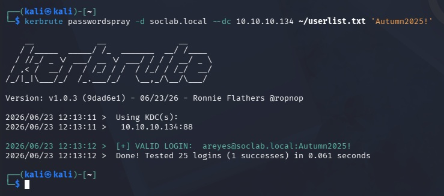

*The loud spray: 25 accounts, one password, one green `VALID LOGIN: areyes`. Note the time — **0.061 seconds** for 25 authentication attempts. No human and no application authenticates as 25 different users in a fraction of a second; that burst velocity is itself a detection signal, the spray cousin of the 11-millisecond ticket pair from the Kerberoasting roast.*


One account came back green: `areyes@soclab.local:Autumn2025!`. Twenty-four failed, one landed, in 61 milliseconds. The attack worked — but before trusting any SIEM, I confirmed the telemetry at its source. On the DC, reading event 4771 (the failures) directly:

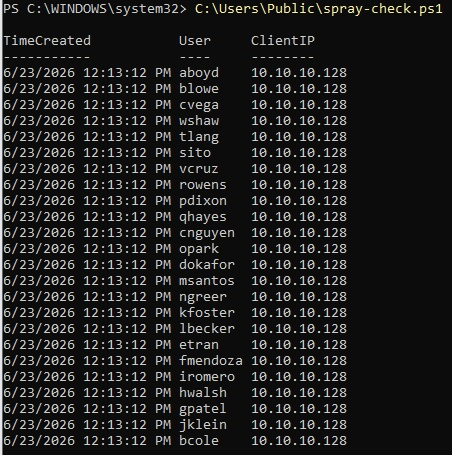

*The attack at the source: 24 distinct usernames, one client IP (`10.10.10.128`), one timestamp (`12:13:12`). That trio — many users, one source, one moment — is the spray. Pull any single row out and it's a nothing-event: one user typo'd a password once. Only the aggregate means anything. **That is the entire detection problem in one screenshot.***


Conspicuously absent from those 24 failures: `areyes`. Its password worked, so it logged a 4768 (success) instead — buried in the same instant, hidden among legitimate logon traffic. Surfacing that one success out of the noise turns out to be the hardest and most valuable half of the detection.

---

## Splunk: from aggregation to a rule that names the victim

Splunk indexes everything and lets you aggregate at search time, so the natural progression is to build the detection in escalating steps — each one answering a weakness in the last. That progression *is* the story.

**Step one — raw aggregation.** Turn 24 individual nothing-events into one picture:

```spl
index=* host=WIN-CBG93HEA6LI EventCode=4771 | stats count by user, src_ip
```

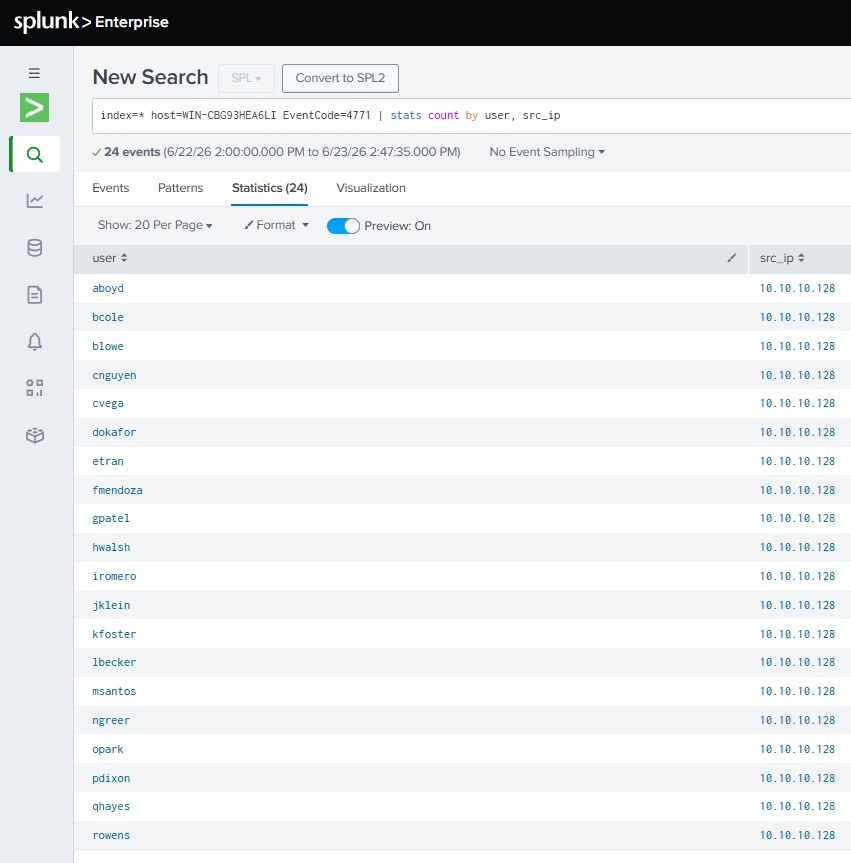

*Aggregation in embryo — 24 distinct users, all from one source. The picture a human can read, but not yet a detection that decides anything.*


**Step two — the spray fingerprint.** The thing that defines a spray isn't the *number* of failures, it's the number of *distinct accounts* one source touched. That's `dc()` — distinct count — and it's the line that turns a table into a verdict:

```spl
index=* host=WIN-CBG93HEA6LI (EventCode=4771 OR EventCode=4768)
| eval result=if(EventCode==4768,"success","failure")
| stats dc(eval(if(result=="failure",user,null()))) as users_failed,
        count(eval(result=="failure")) as failures,
        values(eval(if(result=="success",user,null()))) as compromised
  by src_ip
| where users_failed >= 10
```

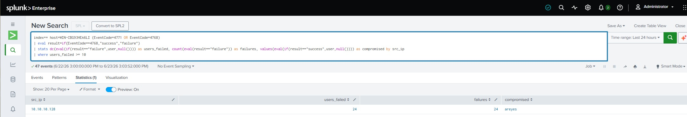

*One row, and it's a complete incident report: source `10.10.10.128` sprayed 24 distinct accounts and **compromised `areyes`** — named, in the `compromised` column. `dc(user)` is what makes this a spray detector and not a generic failed-login counter: a single user fat-fingering their password 24 times shows `users_failed = 1` and never fires. A spray hitting 24 accounts shows 24 and does.*


That `compromised` column is the difference between a tripwire and an incident report. A count-threshold rule tells the analyst "an IP is failing a lot." This one tells them *which account just got taken*, by name, in the same alert. It's the sentence that matters at 2 a.m.

**Why the success-correlation matters — the reset-storm camouflage.** A bare count threshold is dangerous, because a legitimate event looks identical to it: a **password-reset storm**. Helpdesk resets a batch of accounts after a breach scare; cached credentials go stale; suddenly many distinct users fail auth from one source in a short window — indistinguishable from a spray to a `dc(user) >= 10` rule. Worse, a competent attacker can *deliberately* time a spray to hide inside an expected reset storm — burying the real attack in noise the SOC has already written off, a window of blindness driven straight through.

The discriminator that defeats the camouflage is exactly the success correlation. A reset storm produces *zero* guessed-password successes. A spray hiding inside one still produces that single anomalous 4768 — a previously-failing account suddenly getting a TGT *from the same source* that's failing against everyone else. The storm can hide the failures; it cannot manufacture that success. So a detection built on "failure burst **+** correlated success from the same source" sees through the flood that a pure threshold rule is blind to. (The genuine-insider case is a different signature entirely and out of scope here — an insider already has valid credentials and doesn't generate a wall of failures at all; that's behavioral-baseline territory, not spray logic.)

---

## Wazuh: the stock rule already caught it — so I improved on it

Wazuh is a real-time, rule-driven engine, and it surprised me. Where it had been *silent* out of the box against the Kerberoasting attack, here it woke up on its own:

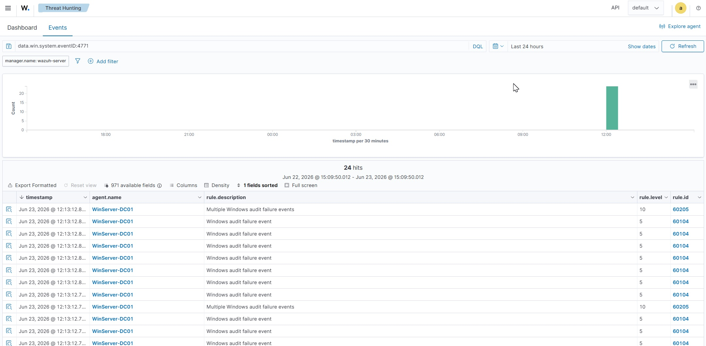

*Out of the box: every 4771 fires stock rule **60104** (per-event failure, level 5), and stock rule **60205** ("Multiple Windows audit failure events", level 10) is *already* firing on the burst. Unlike the Kerberoasting case, the stock ruleset catches this attack with zero custom work — because a spray is a **volume** pattern, and Wazuh ships generic volume-correlation rules.*


That the two SIEMs behaved *oppositely* across two attacks is itself worth naming: Wazuh slept through the AES Kerberoast (a single-event behavioral fingerprint it had no rule for) but wakes up on the spray (a volume burst it has generic rules for). The tools' built-in coverage maps to the *shape* of the attack. That's not a flaw in either — it's the argument for running both.

But the stock rule isn't good enough, and reading it shows exactly why. Rule 60205 chains off the per-event failure rule and keys only on `same_field win.eventdata.ipAddress` plus a raw count — it asserts "many failures from one source" but **not "against different users."** It would fire identically on one stuck service account failing eight times, which is not a spray. So the improvement is to chain a custom rule off 60205 and add the one condition it lacks: distinct target users.

```xml
<rule id="100200" level="12">
  <if_matched_sid>60205</if_matched_sid>
  <different_field>win.eventdata.targetUserName</different_field>
  <description>Possible Password Spray - multiple distinct accounts failed from $(win.eventdata.ipAddress)</description>
  <mitre>
    <id>T1110.003</id>
  </mitre>
  <group>authentication_failures,password_spray,</group>
</rule>
```

The first version of this rule stayed silent — and the reason is a lesson carried straight from the Kerberoasting rule tree. My initial rule chained off **60104** (the per-event rule) with its own `same_field`/`frequency`, which made it a near-duplicate of stock rule 60205 competing for the same parent. The stock rule, loaded first, won the engine's traversal and consumed the correlation; mine never got its turn. Reading the stock ruleset (`grep` for 60205 in `0580-win-security_rules.xml`) revealed the collision, and the fix was to stop competing and stand on its shoulders: chain off 60205 itself, so the rule means "when Wazuh's own burst rule fires, *then* check whether it's the spray shape." That's also a better design — the engine does the heavy counting once, and the custom rule adds only the distinct-user precision.

It fired:

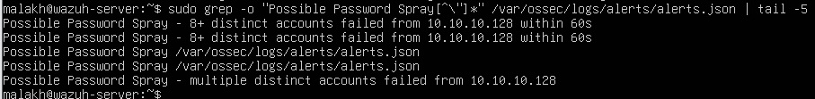

*Rule 100200 in the manager's own alert ledger — confirmed at the source (`alerts.json`), not trusted from the dashboard. The description renders the live source IP. (The earlier "8+ distinct... within 60s" lines are from the first rule version; the bottom line is the re-parented rule.)*


And it surfaces correctly in the dashboard, including Wazuh's native MITRE view:

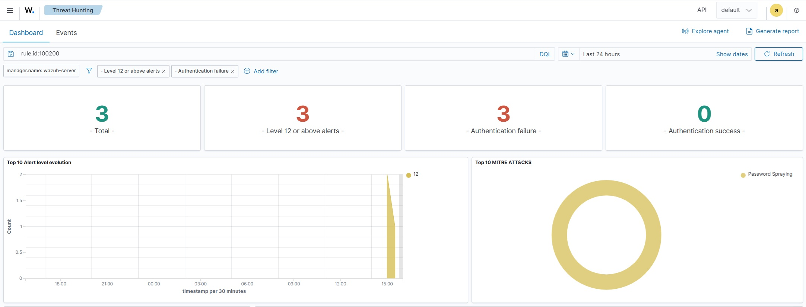

*The custom rule firing at level 12, mapped to **Password Spraying** in the MITRE ATT&CK panel. The `<mitre><id>T1110.003</id></mitre>` tag feeds Wazuh's native threat model — the rule isn't just firing, it's integrated into the framework a SOC actually uses.*


So both SIEMs catch the loud spray, through genuinely different mechanisms: Splunk by search-time aggregation plus success-correlation, Wazuh by real-time frequency correlation refined with a distinct-user condition. Same attack, two detection philosophies. That's the payoff of the dual-SIEM lab — and it's about to become the entire point, because next I tried to break both of them.

---

## Low-and-slow: defeating my own detections on purpose

A competent attacker knows threshold rules exist. So they do the opposite of the loud spray: a few attempts, spread thin across a long time, never letting the failures pile up fast enough to trip a count-in-a-window rule. Same total attack, smeared across hours instead of milliseconds.

I scripted a paced spray — one account every five minutes — and let it run for nearly two hours, deliberately choosing real time over a sped-up demo, because the realism is the point. (The pacing itself was the most stubborn part of the whole exercise, for a reason that had nothing to do with security: my browser-to-terminal paste reliably mangled the loop — eating redirect characters, collapsing newlines, corrupting even base64 — until I stopped pasting and typed it. A real environment gotcha, logged in the lessons below. Worth noting that the slowness also desynchronized one thing: at one point I caught a mistyped password silently turning a whole run into 25 failures and zero successes, which would have quietly destroyed the most important part of the detection. The success on `areyes` is the needle; losing it to a typo would have left nothing to find.)

The question this answers: does the detection survive a patient attacker? I ran the *same* distinct-user logic at two different window sizes against the live slow spray.

**A tight alerting window — what a real scheduled rule would use.** Over the last 15 minutes:

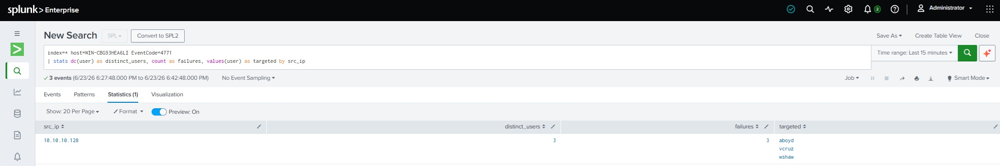

*The evasion, live. In any 15-minute slice, the slow spray has touched only ~3 distinct accounts — far under a threshold of 8. A short-window alerting rule looks at this and sees nothing worth paging anyone about. The attack is actively running and **invisible at this time scale.** (That `aboyd, vcruz, wshaw` are non-consecutive in the list confirms the spray had been pacing steadily for over an hour.)*


**A one-hour window — the fix.** Same logic, wider lens, plus a time-span field that tells the analyst this was *slow*:

```spl
index=* host=WIN-CBG93HEA6LI (EventCode=4771 OR EventCode=4768)
| eval result=if(EventCode==4768,"success","failure")
| stats dc(eval(if(result=="failure",user,null()))) as users_failed,
        count(eval(result=="failure")) as failures,
        values(eval(if(result=="success",user,null()))) as compromised,
        min(_time) as first_seen, max(_time) as last_seen
  by src_ip
| eval span_minutes=round((last_seen-first_seen)/60,1)
| where users_failed >= 8
```

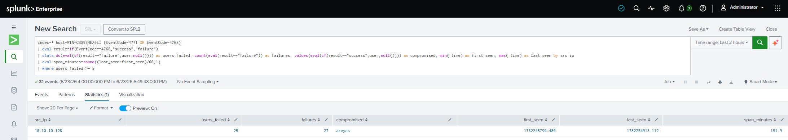

*The catch. Over the longer window the slow spray is unmistakable — 25 distinct accounts, `compromised: areyes`, and `span_minutes` of **151.9**. That span field is the production-grade tell: a loud spray shows a span near zero; this one is spread across two and a half hours. Same distinct-user logic, opposite time signature — and the time signature is what tells an analyst "patient adversary," not "glitch."*


The fix for low-and-slow isn't a bigger threshold — it's a different *shape*: stop counting failures fast, and start counting **distinct users per source over a long rolling window**. One source failing against many accounts over an hour is abnormal at any speed, because the durable truth of a spray is that one origin touches accounts it has no business touching. A legitimate workstation authenticates one or two users; a spray source touches dozens. That holds whether the attacker is fast or slow.

A bonus finding surfaced from running this for real rather than fast. In a strict 60-minute window, the `compromised` column came back *empty* — because the spray walks the list in order, `areyes` is first, and by evaluation time its success was more than 60 minutes old and had aged *out* of the window while the failures inside it were plentiful. The very slowness that defeats the threshold also **desynchronizes the success from the failures relative to any fixed window** — so a window-bound rule can catch the spray but miss the compromise. Widening the window to two hours recaptured `areyes` (the screenshot above). The operational fix is to give the success-correlation a longer, independent lookback, or a stateful lookup that remembers a flagged success and re-associates it when the failures are detected later. That edge only shows up against a genuinely slow attack — which is exactly why I ran one.

---

## Where Wazuh goes blind — and why it's an architecture problem, not a bug

Then I checked Wazuh, and it had caught *nothing* from the slow spray. Not because the rule was broken — because the attack was built to make it irrelevant.

My rule 100200 chains off stock rule 60205, which needs **8 failures from one source within 240 seconds**. The slow spray produces **one failure every 300 seconds**. It never reaches two in any 240-second window, let alone eight. The frequency engine never trips:

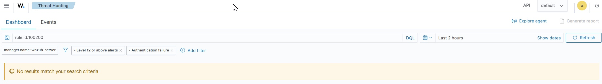

*Rule 100200 across the entire slow-spray window: nothing. The streaming frequency engine is silent — the failures never accumulated fast enough to trigger it.*


"No results" alone could mean a bad filter rather than a real miss, so I proved the silence by confirming the failures *were* arriving the whole time:

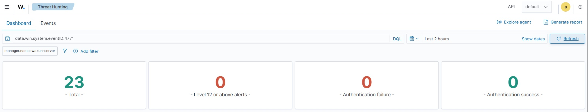

*The airtight proof: **23 failure events present, zero high-severity alerts.** The telemetry flowed the entire time; the spray rule fired zero times. Not missing data — the rule is structurally blind to the paced attack. (The "absence of an error is information" lesson from the buildout, in a new form: here, the absence of an alert against present data is the finding.)*


This is the central architectural finding, and it's worth stating plainly because it's the kind of thing that separates understanding detection *operations* from understanding detection *syntax*:

**Wazuh's streaming frequency engine cannot natively count distinct values over a long window. Splunk's search model can.** Wazuh's correlation primitive is `frequency` + `timeframe` — it's purpose-built for short bursts, and it has no native way to ask "how many distinct usernames has one source failed against over the last two hours?" Pushing `timeframe` out to hours is clunky and bounded. Splunk's `stats dc(user) by src_ip` over an arbitrary range is trivial and exact, because distinct-count over a long window is its native strength.

So for a *low-and-slow* attack, the search-based SIEM has a genuine architectural advantage over the streaming rule engine. This isn't "Splunk is better." It's that these are two different detection paradigms, and **the attack's time profile decides which one wins.** A fast burst plays to Wazuh's real-time strengths — instant correlation, no scheduled-search lag. A patient spray plays to Splunk's aggregation strengths. Running both is how you cover both. That sentence is the entire reason this lab has two SIEMs, and it took a slow spray to make it concrete.

---

## What actually transferred

Spray detection is, at its core, a refusal to draw a conclusion from a single event. One failed login is noise; one failed login is *always* noise; the attack exists only in the pattern across many of them, separated from a reset storm only by a correlated success, and separated from nothing-at-all (the slow case) only by a long-enough window. None of that is a tooling skill. It's the same desk discipline I spent two decades on: never trust a single source, corroborate before you commit, and when one source comes back empty, ask whether you're looking at the wrong source before you conclude there's nothing there.

That last instinct is exactly what kept the Wazuh "no results" from being misread as a failure. A single empty panel proves nothing — it could be a stale filter (it was, once, and I had to clear it), a wrong time range, or a genuinely silent rule. The discipline is to second-source it: confirm the failures are present *independently* before concluding the rule is blind. Splunk and Wazuh weren't redundant here — they were two sources I played against each other, and the moment they disagreed (Splunk caught the slow spray, Wazuh couldn't) was the moment the finding got *cheaper*, because the disagreement pointed straight at the architectural reason.

I'm new to the tools. "Diagnose, don't guess" isn't a slogan I had to learn — it's source-evaluation with a different vocabulary, and it's the reason this ended in two detections I trust and a clear-eyed map of where each one fails.

---

## Lessons worth keeping

1. **A Kerberos spray is 4771/4768, not 4625.** A rule that only watches NTLM logon failures is blind to a Kerberos spray. Match the telemetry the *tool* actually generates, not the one the textbook assumes.
2. **`dc(user)` is the spray fingerprint.** Counting failures catches a stuck service account too. Counting *distinct users from one source* is what actually means "spray."
3. **Improve on the stock rule; don't ignore it or blindly trust it.** Wazuh's 60205 already catches the burst but lacks the distinct-user check. Chaining off it (not competing with it) adds precision and avoids the rule-tree collision that silenced my first attempt.
4. **The success-correlation is the flood-resistant discriminator.** A reset storm — or an attacker hiding inside one — produces no guessed-password success. Tying the 4768 to the failure burst from the same source names the victim and sees through the camouflage.
5. **Low-and-slow defeats thresholds by design, and the fix is shape, not size.** Don't widen the window forever; switch from "many failures fast" to "many distinct users per source over a long window."
6. **Streaming engines and search engines fail on opposite attacks.** Wazuh's frequency engine can't count distinct values over hours; Splunk's search model can't react in true real time without a scheduled-search interval. The attack's time profile decides which one wins — which is *why* you run both.
7. **Window boundaries desynchronize slow attacks.** When an attack spans longer than the detection window, the success and the failures can land in different windows. Give the success-correlation an independent, longer lookback.
8. **No lockout means detection is the only control.** `LockoutThreshold = 0` removes prevention entirely; the alarm is all that's left, which raises the stakes on every rule in this writeup.
9. **Boring traps cost real time:** browser-to-terminal paste silently mangles scripts (type, don't paste); a mistyped spray password turns a two-hour run into all-failures-no-success; and a leftover dashboard filter hides level-5 events behind a "Level 12+" chip and shows a false "no results."

---

## Appendix: the working detections

**Splunk — loud spray, correlated to the compromised account:**

```spl
index=* host=WIN-CBG93HEA6LI (EventCode=4771 OR EventCode=4768)
| eval result=if(EventCode==4768,"success","failure")
| stats dc(eval(if(result=="failure",user,null()))) as users_failed,
        count(eval(result=="failure")) as failures,
        values(eval(if(result=="success",user,null()))) as compromised
  by src_ip
| where users_failed >= 10
```

**Splunk — low-and-slow, with time-span signature (1-hour scheduled window):**

```spl
index=* host=WIN-CBG93HEA6LI (EventCode=4771 OR EventCode=4768)
| eval result=if(EventCode==4768,"success","failure")
| stats dc(eval(if(result=="failure",user,null()))) as users_failed,
        count(eval(result=="failure")) as failures,
        values(eval(if(result=="success",user,null()))) as compromised,
        min(_time) as first_seen, max(_time) as last_seen
  by src_ip
| eval span_minutes=round((last_seen-first_seen)/60,1)
| where users_failed >= 8
```

**Wazuh — custom rule `100200`** (in `/var/ossec/etc/rules/local_rules.xml`):

```xml
<group name="windows,authentication_failures,password_spray,">
  <rule id="100200" level="12">
    <if_matched_sid>60205</if_matched_sid>
    <different_field>win.eventdata.targetUserName</different_field>
    <description>Possible Password Spray - multiple distinct accounts failed from $(win.eventdata.ipAddress)</description>
    <mitre>
      <id>T1110.003</id>
    </mitre>
    <group>authentication_failures,password_spray,</group>
  </rule>
</group>
```

**Scope note:** the Wazuh rule chains off stock frequency rule 60205 (8 failures from one source in 240 seconds) and adds the distinct-user condition — so it's high-fidelity against a *loud* spray and, by design, **blind to a low-and-slow spray** that stays under that frequency. That blindness isn't a defect to hide; it's the architectural finding of this piece. The Splunk searches catch the slow case because a search engine can count distinct values over an arbitrary window; a streaming rule engine can't. Two open threads for a future iteration: a Wazuh composite rule that ties the 4768 success to the spray source (Splunk does this; Wazuh doesn't yet), and a stateful long-window approach to catch the slow spray Wazuh currently misses. Catching the loud and the lazy with near-zero false positives is the right *first* deliverable; the robust next tier is behavioral baselining of distinct-users-per-source over time.

---

## Author

[Malakh Fuller](https://www.linkedin.com/in/malakhfuller/) · [GitHub](https://github.com/MalakhFuller)

