# Privilege Escalation Without an Exploit — Walking an ACL Chain to the krbtgt Hash, and What Each SIEM Could (and Couldn't) See

*Part of an ongoing detection-engineering series — each entry takes one intrusion technique end to end through two SIEMs. This one is privilege escalation: the post-foothold climb where a low-privilege account becomes control of the whole domain — here, entirely through permissions the directory was configured to grant, with no exploit anywhere in the chain.*

**Completed:** 2026-06-25

**Author:** Malakh Fuller

> **Privacy note:** Internal lab IP addresses have been anonymized in this writeup and related screenshots. All testing was performed exclusively on my own isolated home lab network, against accounts I created specifically to be attacked.

> **How to read this:** This is the honest version. The climb itself went smoothly — that's the unsettling part, and it's the whole point. Nothing broke, nothing failed, no exploit fired; an account that should have been able to do almost nothing walked itself to the keys of the domain using features working exactly as designed. Where the work got hard was the blue side, and in three different shapes: the recon was textbook-*loud* and still nearly undetectable, because a single ordinary workstation out-talks the attacker on the wire; one of my two SIEMs flatly refused to collect the telemetry the detection needed, and I'm documenting that gap rather than papering over it; and the password-reset rule wouldn't fire until I killed the exact same field-match that fought me in the Kerberoasting piece — the same ghost, a second time. There's also one link in the attack chain I modeled rather than fully exploited, and I flag it in plain sight where it happens. A writeup where every rule fires first try and every SIEM sees everything is a writeup where nothing was learned. The gaps are in here on purpose.

> **On AI:** As with the rest of this series, I used Claude as a research and troubleshooting partner. The pattern was the same one I'll stand behind in any room: when the Wazuh rule wouldn't fire, or the Directory Service channel wouldn't forward, or the enumeration drowned in legitimate noise, the two of us bisected the problem one probe at a time — it proposed the next test, I ran it and fed back the result, and we narrowed the fault together. Every command was one I ran, every wall was one I hit myself, and every judgment call — when to keep grinding a Wazuh channel and when to call it a documented gap, when a modeled chain link was honest and when it would have been a lie — was mine. Every claim here I can defend with the tab closed. I'd have reached the same working rules without AI; it would simply have cost me days of forum threads instead of an evening, in a field where the ground shifts weekly. The carpenter who refuses power tools still builds the house — it just takes him longer, and fewer people line up to hire him.

---

## Objective

Take the lab from where the password-spraying piece left it — one cracked, low-privilege domain account — and find out how far that single foothold reaches when the directory's own permissions are misconfigured the way real directories are. Then hunt every stage of the climb in both SIEMs and map exactly what each one catches.

The technique is privilege escalation, and specifically the flavor that makes it genuinely hard to detect: **escalation by permission, not by exploit.** The MITRE pieces in play are Account Manipulation ([T1098](https://attack.mitre.org/techniques/T1098/)) for the ACL abuse, OS Credential Dumping: DCSync ([T1003.006](https://attack.mitre.org/techniques/T1003/006/)) for the payoff, and account/group discovery ([T1087](https://attack.mitre.org/techniques/T1087/) / [T1069](https://attack.mitre.org/techniques/T1069/)) for the recon that finds the path. Not one of them throws an error, trips a failed-logon, or drops a file. Every action is an authorized account doing something it is allowed to do — which is exactly why failure-based detection sleeps through it.

Concretely, the goals:

- **Execute the climb as an ACL abuse chain** — a sprayed user with `GenericAll` over a service account resets that account's password, takes it over, and rides its replication rights to a full credential dump. No CVE, no malware, no privilege-escalation *exploit*; permissions all the way down.
- **Pull the krbtgt hash via DCSync** and show what "full domain compromise" actually means — and why it's the one result you can't fix with a password reset.
- **Hunt each stage in both SIEMs**, and demonstrate in real data where each catches the attack, where each is blind, and *why* — including one collection gap I could not close.
- **Hand-write working Wazuh rules** for the stages Wazuh can see (the password reset and the DCSync) — the deliverables — and honestly document the stage it can't.

The goal was never a clean tutorial-to-a-screenshot. It was to confront the part of this technique that makes it a real detection problem in 2026: when the attack *is* legitimate functionality, you stop watching for things that break and start watching for the *wrong principal* doing a *normal thing* — and that's an attribution problem, not a signature one.

## Tools and Technologies

| Category | Details |
| --- | --- |
| Attack tooling | Impacket (`getTGT`, `secretsdump`), NetExec (`nxc ldap`), `net rpc password` on Kali Linux 2026.1 |
| Recon | NetExec authenticated LDAP enumeration over Kerberos, targeted LDAP object queries |
| SIEM #1 (rule-driven) | Wazuh 4.14.5 — custom rule authoring in `local_rules.xml`, decoder and rule-chain analysis |
| SIEM #2 (index-everything) | Splunk Enterprise 10.4 — SPL, attribution searches, `rex` field extraction |
| Network sensor | Suricata (eve.json LDAP protocol decode), forwarding to both SIEMs |
| Target | Windows Server 2025 domain controller, AD DS `soclab.local`, LDAP signing **Enforced** |
| Telemetry | Windows Security 4662 / 4724 / 4738, Directory Service 1644 (LDAP query auditing), Suricata LDAP events, Wazuh `windows_eventchannel` decoder |
| Technique | MITRE ATT&CK T1098 (Account Manipulation), T1003.006 (DCSync), with T1087 / T1069 discovery |
| Skills applied | AD ACL-abuse chaining, DCSync, AdminSDHolder/SDProp internals, LDAP enumeration detection, SPL attribution and field extraction, Wazuh rule engineering (`if_sid` chains, eventdata field matching), multi-source corroboration, MITRE mapping |
| Prior knowledge | CompTIA A+, Network+, Security+, CySA+ (in progress), prior home SOC labs (password spraying, Kerberoasting) |

## Environment (the machines in play)

| VM | Role in this exercise | IP |
| --- | --- | --- |
| Kali-AttackBox | Attacker — sprayed user `areyes` | 10.10.10.128 |
| WinServer-DC01 (`WIN-CBG93HEA6LI`) | Server 2025 DC — target *and* telemetry source | 10.10.10.134 |
| WazuhServer-SIEM01 | SIEM #1 — Wazuh 4.14.5 | 10.10.10.130 |
| Splunk-SIEM02 | SIEM #2 — Splunk Enterprise 10.4 | 10.10.10.137 |
| Suricata-Sensor01 | Network sensor — LDAP wire visibility | 10.10.10.140 |
| Win11-Victim01 (`DESKTOP-6H1BPIU`) | Ordinary domain workstation — the unwitting noise source | 10.10.10.131 |

*The full seven-VM roster and network architecture live in the Phase 2 buildout writeup. The six machines above are the ones in play here — and Win11 earns its seat in the table this time, because its perfectly normal LDAP chatter is the thing that nearly buried the attacker's recon.*

## Coming in

This sits directly on the password-spraying piece. By the time this exercise starts, the lab already has:

- **One cracked credential, `areyes` / `Autumn2025!`,** carried straight out of the spray. That's the entire starting position — one ordinary domain user, no admin rights, no special access.
- **A planted ACL misconfiguration:** `areyes` holds `GenericAll` over the service account `svc_sql`. I planted it deliberately, and it's not a contrivance — over-permissioned helpdesk delegation, "temporary" full-control grants that never get revoked, and service accounts with sloppy ACLs are some of the most common real findings in any AD environment. `GenericAll` is the misconfiguration that turns a nobody into a problem.
- **Both SIEMs collecting Windows Security and Sysmon telemetry from the DC** — Wazuh via its agent, Splunk via a Universal Forwarder — plus **Suricata watching the wire** and feeding both. Three independent vantage points on one domain, which is the whole reason this lab can show where each one is blind.

One carried-forward gotcha that bites again here: the DC's real computer name is the auto-generated `WIN-CBG93HEA6LI`, not its friendly VM label. Splunk keys on the real name, so searching the label returns nothing — an old lesson that resurfaces the moment I start hunting.

---

## The climb: nothing broke, and that's the problem

Here's the whole arc up front, then the long version. A sprayed account named `areyes` — the kind of nobody a phishing email produces by the dozen — held one quiet misconfiguration: full control over a service account. It used that control to reset the service account's password and take it over. The service account, in turn, could replicate the directory. So `areyes` asked the domain controller to hand over the directory's secrets, and the DC, seeing a request it was configured to honor, handed over the krbtgt hash — the master key to every Kerberos ticket in the domain. Foothold to total compromise, and at no point did anything fail, error, or get blocked. Every step was a permitted action by an account permitted to take it.

That's what makes privilege escalation by ACL abuse a different animal from the spray or the roast in the earlier pieces. Those attacks at least *look* like attacks somewhere — a pile of failed logons, a weird encryption type. This one looks like Tuesday. A help-desk tech resets a password; a replication service replicates. The malice isn't in the action, it's in the *actor* — and you only see it if you're watching who is doing the normal thing, not whether something abnormal happened.

I want to be upfront about where I'm coming from, because it shapes how I worked the back half. I'm still new to the tooling — the certs are fresh and the hands-on is newer. Security+ taught me what DCSync *is* in a one-line bullet; it did not prepare me for how completely ordinary it looks in a log. What I'm not new to is the analytical half of this work. Two decades in competitive intelligence, and the part I owned was never the gathering — it was the *evaluation*: who is the source, does their access explain what they're claiming, and is this report consistent with everything else I know? That is the exact muscle this attack demands of a defender, because here the log line is honest and the only question worth asking is whether the principal behind it had any business doing what it did.

So: the climb, link by link, then what each SIEM saw.

---

## Recon, and the wall that moved

Before `areyes` could abuse anything, it had to find the path — and the first path I designed for it taught me something about Active Directory I'd only ever read in a bullet point.

The starting move is the quietest one in the whole exercise: an authenticated LDAP bind as `areyes`, just to confirm the credential works and the directory is readable. Because the DC enforces LDAP signing, the legacy tools (`ldapdomaindump`, older BloodHound ingestors) fall over on the unsigned channel; NetExec seals the Kerberos channel properly and binds clean.

```bash
impacket-getTGT soclab.local/areyes:'Autumn2025!' -dc-ip 10.10.10.134
export KRB5CCNAME=areyes.ccache
nxc ldap WIN-CBG93HEA6LI.soclab.local -u areyes -k --use-kcache
```

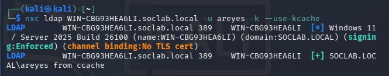
<br>
*Authenticated LDAP bind as `areyes` over Kerberos. `signing:Enforced` is why this needs a properly sealed channel — the legacy unsigned tools get refused here.*

Now the part I'm keeping in because it's the realest thing in the writeup. My *first* chain design didn't go through `svc_sql` at all. It went through a delegated help-desk group called `IT-Support`: give `areyes` full control over that group, drop `areyes` into it, and inherit the group's privileges. I built it, walked away, came back — and the ACL was *gone*. Rebuilt it. Gone again within the hour. No error, no log of a removal I'd done, just an permission that refused to stay put.

The recon explained it. A targeted query on the `IT-Support` object showed the tell:

```bash
nxc ldap WIN-CBG93HEA6LI.soclab.local -u areyes -k --use-kcache --query "(cn=IT-Support)" ""
```

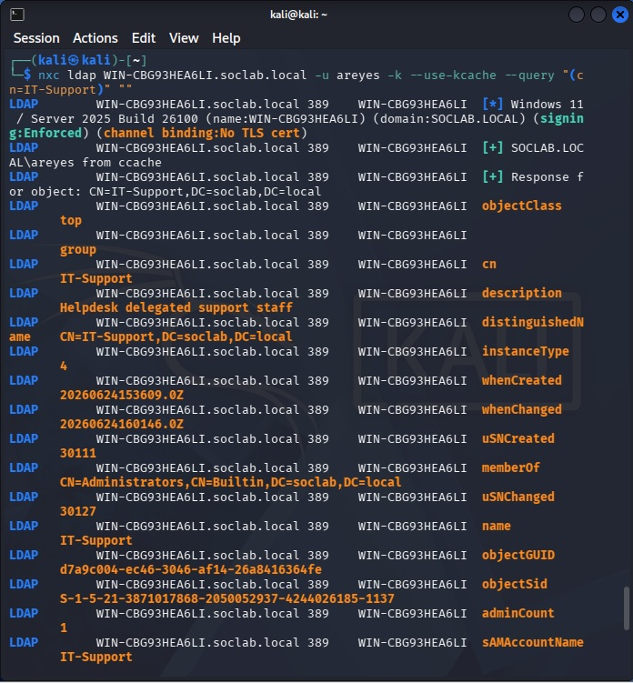
<br>
*The `IT-Support` object: `memberOf: CN=Administrators` and — the line that explains everything — `adminCount: 1`. The group was nested in Administrators, which made it a protected object, which is why my ACL kept evaporating.*

`adminCount: 1` and membership in `Administrators` meant `IT-Support` was a **protected object**, and Active Directory has a quiet janitor for protected objects called **SDProp**, the process behind AdminSDHolder. Roughly once an hour, SDProp re-stamps every protected principal's ACL back to a locked template, wiping any custom permission someone (me, or an attacker) added. It exists precisely to stop the move I was attempting — you can't durably backdoor a group that's in Administrators, because the directory keeps healing it. That's not a bug I hit; that's a *defensive control working*, and I'd never have understood it as a concrete thing rather than an exam term if it hadn't silently eaten my ACL twice.

So I moved the chain off the protected group and onto `svc_sql` — an ordinary, *unprotected* service account that SDProp doesn't touch. The `GenericAll` grant there survived overnight, every night. The redesign is the lesson: **protected objects are the ones AD heals; unprotected service accounts are the soft target an attacker actually reaches for** — and they're everywhere, because nobody nests them in Administrators and nobody watches their ACLs.

That's the path found. Now the climb.

---

## The takeover: resetting a password you were never told

This is the hinge of the whole chain, and it's one command. `GenericAll` over an object includes the right to reset its password — *without knowing the current one.* That's the entire trick. `areyes` was never given `svc_sql`'s password and never needed it; full control means you simply overwrite it:

```bash
net rpc password svc_sql 'NewPass2026' -U soclab.local/areyes%'Autumn2025!' \
  -S WIN-CBG93HEA6LI.soclab.local
```

Silent return, and `svc_sql` now answers to a password `areyes` chose. The service account is taken over. In a real environment this is the moment a low-value foothold becomes a high-value one, and it's invisible to anyone watching for failed authentication — because nothing failed. `areyes` had the right. It used it.

From here `areyes` can mint a Kerberos ticket as `svc_sql` and act as that account entirely. Which matters, because of what `svc_sql` can do next.

---

## The crown: DCSync, and the one link I modeled

The payoff of the chain is **DCSync** — abusing the directory-replication protocol (DRSUAPI) that real domain controllers use to sync with each other. An account holding the replication extended rights can ask a DC to *replicate* account secrets to it, and the DC complies, because that request is exactly what replication is *for*. Point it at `krbtgt` and you get the hash that signs every Kerberos ticket in the domain — the master key.

One honest disclosure, in plain sight where it happens. A fully end-to-end pentest would need one more ACL hop here: the attacker would have to leverage control of `svc_sql` to grant *itself* the replication rights, which requires `WriteDacl` on the domain head — another link in the chain. Because this series is about **detection, not exploitation**, I granted `svc_sql` the DCSync rights administratively to model the post-escalation state, rather than building out that final hop. I'm flagging it because the alternative is the polished lie this series exists to avoid. And it changes nothing about the detection, which is the entire point: **the replication request looks identical no matter how the account acquired the rights.** The blue-team problem is the same either way.

With `svc_sql` taken over and holding replication rights, the dump is one command:

```bash
impacket-secretsdump -k -no-pass -dc-ip 10.10.10.134 -just-dc-user krbtgt \
  soclab.local/svc_sql@WIN-CBG93HEA6LI.soclab.local
```

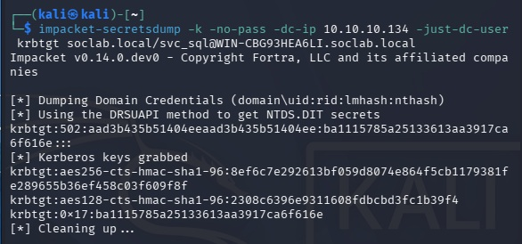
<br>
*DCSync via `secretsdump`, using the DRSUAPI replication method. The `krbtgt:502:` NTLM hash and the AES256/AES128 Kerberos keys come back — the master key to the domain. This is the result you cannot remediate with a password reset; rotating krbtgt takes two careful resets and a domain-wide ticket purge, and until you do, every forged "golden" ticket stays valid.*

Before trusting any SIEM to render this, I confirmed it at the source — the same discipline I'd apply to any single report. On the DC, the replication request lands as Security event **4662**, the one that records directory-object access against the replication GUIDs:

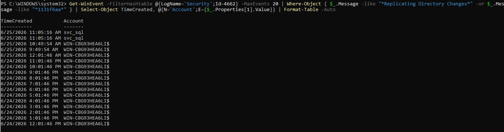
<br>
*The primary record on the DC: event 4662 carrying the replication-changes GUID, requested by `svc_sql`. Every other row is the DC's own machine account (`WIN-CBG93HEA6LI$`) doing legitimate, scheduled replication. The single `svc_sql` row is the attack — a service account asking to replicate the directory, which it has no earthly reason to do.*

That last screenshot *is* the detection thesis, sitting in the raw log before any SIEM touches it: the malicious event and the benign events are the **same event type**. The only thing that separates them is who's asking. Hold that line — *a service account requesting replication is the anomaly, not the request itself* — because everything in the detection half hangs off it.

---

## The detection problem, stated plainly

Now flip to the blue side. Across all three stages of this climb, the defender's problem is identical and it is not the problem the earlier pieces had. In the spray, the attack looked wrong (a wall of failed logons). In the roast, the artifact looked wrong (a legacy cipher). Here, **nothing looks wrong.** The recon is a normal LDAP session. The takeover is a normal password reset. The dump is a normal replication request. Failure-based detection — the bread and butter of a default SIEM ruleset — has nothing to grab, because nothing failed.

So detection has to move from *did something break* to *did the right principal do this* — from signature to **attribution**. And attribution turned out to be hard in a different way at each stage:

- **The recon** was loud on the wire and nearly invisible by volume, because one ordinary workstation generates more LDAP traffic than the attacker does.
- **The password reset** needed a rule that compares two fields in the same event — the actor versus the target — which no stock rule does.
- **The DCSync** needed a rule that knows which accounts are *allowed* to replicate, so it can flag the one that isn't.

Three stages, three SIEM coverage stories. Here they are in order.

---

## Stage 1 — the recon: loud on the wire, invisible by volume

The attacker's broad enumeration sweep is about as loud as recon gets — a full pull of every user, group, and computer in the domain:

```bash
nxc ldap WIN-CBG93HEA6LI.soclab.local -u areyes -k --use-kcache --users --groups --computers
```

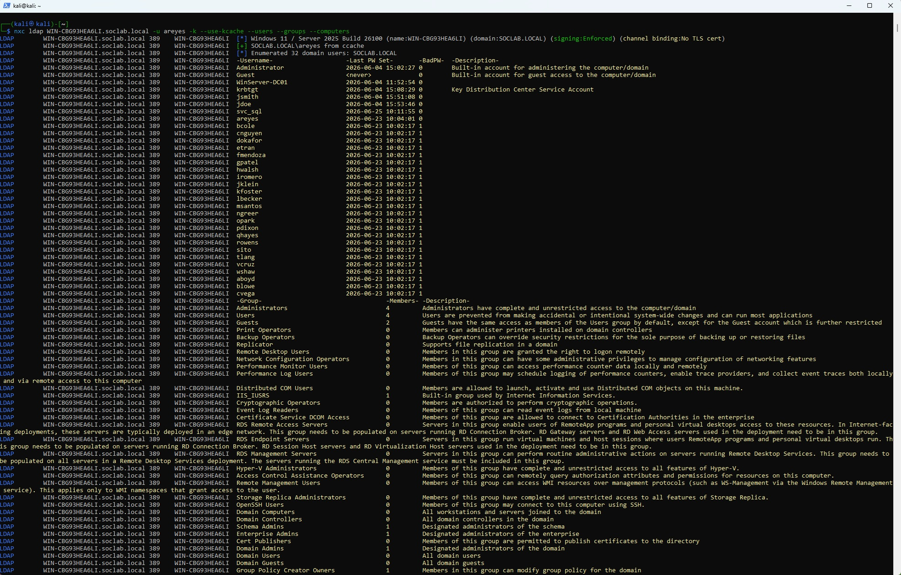
<br>
*Textbook loud enumeration — 32 users, every group, every computer, in one burst. On paper this should light up any detection. In practice it almost lit up nothing, and the reason is the trap of this whole stage.*

Here's the trap. The intuitive detection is *volume*: "a host pulling hundreds of LDAP objects is enumerating, alert on it." I built that instinct and it failed immediately, because my perfectly innocent Win11 workstation — doing normal domain-member things, group policy, name resolution, the usual — generates **more** raw LDAP traffic than the attacker's sweep does. A volume threshold tuned to catch `areyes` pages constantly on `DESKTOP-6H1BPIU` doing nothing wrong. **Loud is not the same as detectable.** Volume is the wrong axis; you need *attribution* — who ran a query shaped like enumeration — not a count.

Two layers got me there. First, the wire. Suricata decodes LDAP at the protocol level, so it sees the operations regardless of what the host logs choose to record:

```spl
index=* host=suricata-sensor01 event_type=ldap src_ip=10.10.10.128
| stats count by dest_ip, ldap.request.operation
```

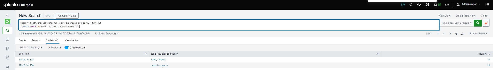
<br>
*Suricata on the wire: the attacker's session to the DC broken out by LDAP operation — 22 binds, 10 searches. The network sensor sees the full shape of the session even when the host's default logs stay quiet. This is the value of an independent network vantage point: it doesn't depend on Windows being configured to talk.*

Second, the host — but only after turning on telemetry that's off by default. Windows can log the *content* of LDAP queries as Directory Service event **1644**, but it's disabled until you set the NTDS diagnostics registry values (`15 Field Engineering = 5`, plus the expensive/inefficient-search thresholds). I enabled it, and immediately hit a smaller version of this lab's oldest ghost: the events were being *written* on the DC but not *forwarded* — the Splunk Universal Forwarder wasn't subscribed to the Directory Service channel until I added it to `inputs.conf`. Audit-enabled is not audit-collected; you have to confirm the event actually arrives, not just that it exists.

Once it flowed, the 1644 event carries the enumeration fingerprint in plain text — the `sAMAccountType` filter that a user-enumeration sweep always sends (`805306368` for users, `805306369` for computers):

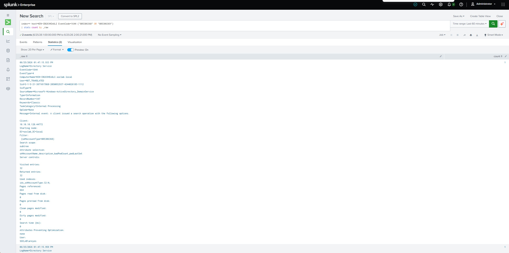
<br>
*The raw 1644: an LDAP search filtered on `sAMAccountType=805306368` (all user accounts), 32 entries visited, and crucially the `User:` field — `SOCLAB\areyes`. The host log names the attacker. That's the attribution the volume approach could never give me.*

And the detection that turns that into an answer — not "how much LDAP," but "who ran the enumeration-shaped query":

```spl
index=* host=WIN-CBG93HEA6LI EventCode=1644 ("805306368" OR "805306369")
| rex field=_raw "Client:\s*(?<client_ip>[0-9a-fA-F:.]+):\d+"
| rex field=_raw "User:\s*(?<account>\S+)"
| stats count as enum_queries values(account) as account by client_ip
```

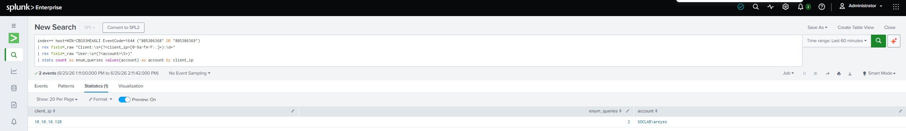
<br>
*The host-side detection: `SOCLAB\areyes` from `10.10.10.128`, pulled out by the account-type filter that legitimate clients don't send in that shape. Attribution, not volume — the query names the attacker out of a haystack the Win11 box would otherwise bury.*

**And the honest gap.** This is where the two SIEMs split hard. Splunk's forwarder happily collects the Directory Service channel once configured. The **Wazuh agent will not** — and I want to be precise about how hard I tried, because "it didn't work" without the receipts is worthless. Six-plus attempts: confirmed the agent service was running, confirmed the exact channel name Windows uses (`Directory Service`, verified via `Get-WinEvent -ListLog`), added it to `ossec.conf` as a `<localfile>` with the `eventchannel` format, added an explicit `<query>` filter for EventID 1644, did clean stop/start cycles, re-fired fresh enumeration each time. The archive (`archives.json`) stayed empty every single time. The Wazuh Windows agent on this version simply does not ship that channel the way the Splunk forwarder does.

So Stage 1's detection lives at the **Splunk + Suricata** layers, and Wazuh is **blind to it** — a real, documented dual-SIEM architectural difference. I'm logging it as a finding rather than burning another night fighting a channel that isn't going to budge. Knowing where a tool *can't* see is worth as much as knowing what it catches; a SOC that assumes Wazuh covers LDAP enumeration because Splunk does would have a hole exactly the width of this gap.

---

## Stage 2 — the password reset: actor isn't target

The takeover fires Security event **4724** — "an attempt was made to reset an account's password." On its own, 4724 is noise; help desks reset passwords all day. The signal is the relationship *inside* the event: the account doing the reset versus the account being reset.

Splunk parses both. Pulling 4724s with their actor and target showed exactly two rows, and the contrast between them is the rule:

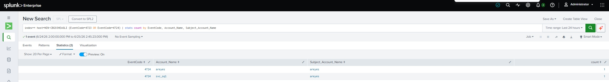
<br>
*Two resets. `areyes → areyes` is a user resetting their own password — benign, ignore it. `areyes → svc_sql` is a regular user resetting a **service account's** password — that's the takeover. The detection is the difference between the two: actor ≠ target, and the target is something a normal user has no business resetting.*

One field-name lesson cost me a few minutes and is worth passing on. A quick `stats` showed the right values but my first `where` clause returned nothing, because Splunk's `stats` had folded both names into a single multi-value `Account_Name` field. The properly parsed fields are `Subject_Account_Name` (the actor) and `Target_Account_Name` (the target) — read the raw event for the real field names before you filter on them, every time:

```spl
index=* host=WIN-CBG93HEA6LI EventCode=4724
| where Subject_Account_Name != Target_Account_Name
| table _time, Subject_Account_Name, Target_Account_Name
| rename Subject_Account_Name as "Reset_By", Target_Account_Name as "Account_Reset"
```

One clean row: `areyes` reset `svc_sql`. The ACL abuse, caught at the moment of execution — earlier in the chain than the DCSync, while there's still time to intervene before the crown is gone.

Then Wazuh, where the ghost from the Kerberoasting piece walked back on stage. I confirmed the event was reaching Wazuh and decoding perfectly — `win.eventdata.targetUserName: svc_sql`, `win.eventdata.subjectUserName: areyes`, exactly the fields I'd match on. I wrote what should have been a trivial rule: match EventID 4724, match the target, fire. It validated, it loaded, it fired on nothing.

I'd seen this exact failure before. In the Kerberoasting build, a `<field name="win.system.eventID">` match silently refused to fire on `windows_eventchannel` events, and the fix was to stop matching the event ID and match an `eventdata` field instead. Same disease here. A `grep` of the archive confirmed the deeper version of it: **no stock Wazuh rule claims 4724 at all** (the only ruleset hit for "4724" is a coincidental Cisco IOS rule), so the event matched nothing, fired no parent, and my rule chaining off the event-ID condition had nothing to grab. The cure was the same one that cracked Kerberoasting: anchor on `60103` — the audit-success gate the event actually travels through — and match the decoded `eventdata` field directly, with the event-ID condition deleted entirely:

```xml
<group name="windows,account_management,acl_abuse,">
  <rule id="100400" level="12">
    <if_sid>60103</if_sid>
    <field name="win.eventdata.targetUserName">^svc_sql$</field>
    <description>Possible ACL abuse - password reset of $(win.eventdata.targetUserName) by $(win.eventdata.subjectUserName)</description>
    <mitre>
      <id>T1098</id>
    </mitre>
  </rule>
</group>
```

Restart, one fresh reset, and it fired — twice, in fact, because the takeover also throws a 4738 ("account changed") alongside the 4724, and both carry `targetUserName: svc_sql`, so the rule surfaces the full reset signature:

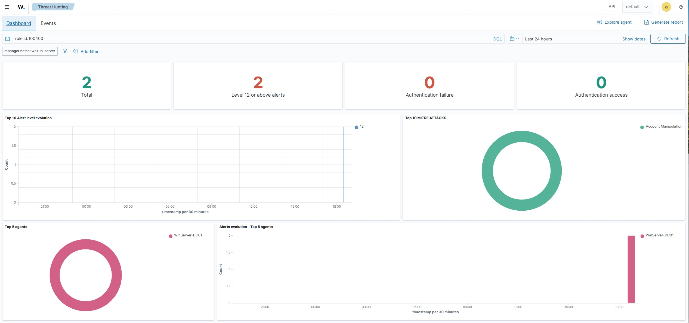
<br>
*Rule 100400 firing in Wazuh: two level-12 alerts mapped cleanly to **Account Manipulation** (T1098). The 0/0 on authentication failure/success is itself a tell — this is account management, not an auth event, which is exactly why a failed-logon rule never sees it.*

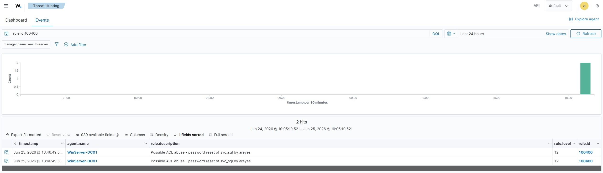
<br>
*The events view: the live attacker named in the description — `password reset of svc_sql by areyes`. The rule renders the actor and target into the alert, so an analyst sees the relationship, not just an event code.*

The recurring finding — and a complication I only caught while assembling this writeup, which is exactly why it's in here. On two techniques now (this 4724 reset and the earlier 4769 Kerberoast), a `win.system.eventID` match on `windows_eventchannel` events refused to fire, and the cure both times was to drop it and anchor on `60103` with `eventdata` field matching. That looked like a clean rule: *"the eventID match is broken, stop using it."* Then I went to pull my live DCSync rule for this appendix and found it **keeps** a `win.system.eventID` match on its 4662 — and fires anyway. So the tidy theory is wrong. The eventID match isn't universally broken; it fails on some event types and works on others, and I don't yet know what separates them. The honest version is: when an eventID match silently fails, switch to `eventdata` matching — it has rescued two rules — but I can't claim the match is dead across the board, because one of my own rules disproves it. A workaround I trust, sitting on top of a root cause I still haven't isolated.

---

## Stage 3 — DCSync: the account that isn't a domain controller

The crown jewel of the chain gets the loudest rule, because it's the highest-confidence signal in the whole exercise. The principle is one line, and it's the most quotable thing I learned in this build: **a DCSync request from an account that isn't a domain controller is almost always malicious.** Real replication comes from machine accounts (the DCs themselves). A *user* or *service* account asking to replicate directory secrets has essentially one legitimate explanation — there isn't one.

The replication request lands as event **4662** carrying the directory-replication extended-right GUIDs (`1131f6aa` = Replicating Directory Changes, `1131f6ad` = Replicating Directory Changes All). In Splunk, the first pass shows both the legitimate and the malicious side by side:

```spl
index=* host=WIN-CBG93HEA6LI EventCode=4662 ("1131f6aa" OR "1131f6ad")
| stats count by Account_Name
```

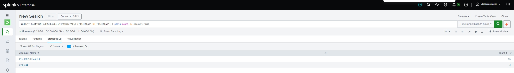
<br>
*Raw replication activity by account: the DC's own machine account (`WIN-CBG93HEA6LI$`, 16) doing its legitimate scheduled job, and `svc_sql` (3) doing the thing a service account should never do. Both are real 4662s; only one is an attack.*

The detection is the filter that encodes the principle — drop the machine accounts (the ones that *should* replicate) and whatever's left is the anomaly:

```spl
index=* host=WIN-CBG93HEA6LI EventCode=4662 ("1131f6aa" OR "1131f6ad")
| stats count by Account_Name
| where NOT match(Account_Name, "\$$")
```

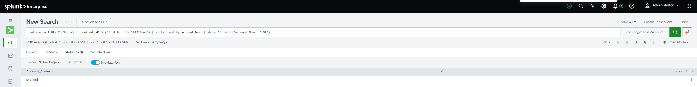
<br>
*Machine accounts excluded (`\$$` matches the trailing `$` every machine account carries), and the noise collapses to a single row: `svc_sql`. The rule doesn't need to know the attack in advance — it only needs to know which accounts are *allowed* to replicate, and flag everything else.*

A field-vs-raw note worth keeping, because the two SIEMs store this differently. In Splunk the replication GUID lives in the raw message text, so a bare-term match (`"1131f6aa"`) is the right tool. In Wazuh, the decoder parses that same GUID into a structured field (`win.eventdata.properties`), so the rule matches the field, not free text. Same IOC, two access patterns — and knowing which tool stores it which way is the difference between a rule that fires and an evening wondering why it doesn't.

The Wazuh rule (`100300`) fires at **level 14** — the highest in this series so far, because full-domain credential theft earns it:

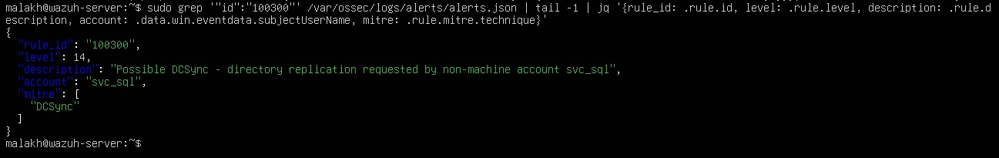
<br>
*Rule 100300 in the alert ledger: level 14, `Possible DCSync - directory replication requested by non-machine account svc_sql`, mapped to DCSync. Pulled straight from `alerts.json` — the manager's own record, not the dashboard.*

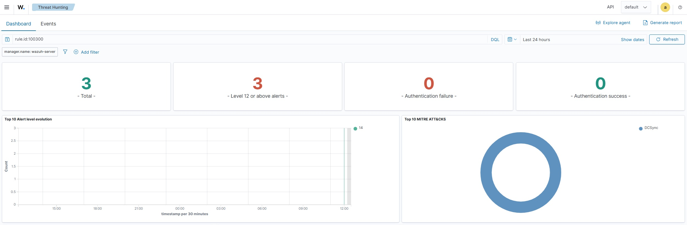
<br>
*The dashboard view: three level-14 alerts, the MITRE donut reading **DCSync**. Same custom-rule-into-native-framework mapping as the rest of the series, now for the crown of the chain.*

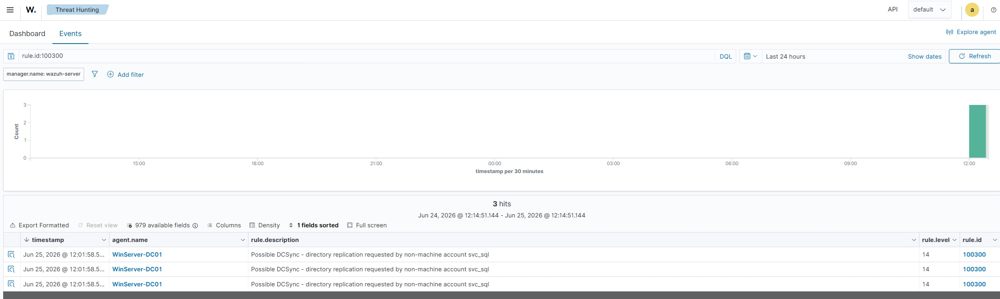
<br>
*The events view: three hits, the description naming `svc_sql` as the non-machine account that asked to replicate. The detection that catches total domain compromise, firing in the rule-driven SIEM.*

Three stages, and the dual-SIEM coverage map comes out honest: **DCSync** and the **password reset** are caught in *both* SIEMs; the **enumeration** is caught at **Splunk + Suricata** with a documented **Wazuh collection gap**. That's not a clean sweep, and a clean sweep would have been a lie.

---

## What actually transferred

I came into this build expecting the attack to be the hard part. It wasn't — the climb was four commands and a permission nobody should have granted. The hard part was the defender's, and it was the part my old job turned out to have trained me for: **the whole detection problem here is attribution.**

Every stage came down to the same question I used to ask at a desk reviewing other people's findings — *does this source's access explain what they're doing?* A 4662 replication request is honest; the only question is whether a service account had any business making it. A 4724 reset is honest; the question is whether the actor should be touching the target. A burst of LDAP queries is honest; the question is whether this principal runs queries shaped like that. In intelligence work you don't catch a bad source by waiting for them to do something impossible — they rarely do. You catch them by knowing what *normal* access looks like for everyone on the board, and noticing the report that doesn't fit the reporter. That's identical to the work here. The malicious log line and the benign one are the same line; the analyst's entire job is knowing which principals are allowed to write it.

And the multi-source habit earned its keep again. Suricata said the enumeration happened; the host's 1644 said *who*; Splunk and Wazuh agreed on the reset and the DCSync, and *disagreed* on the enumeration — and the disagreement wasn't a failure, it was information. It told me exactly where Wazuh's collection ends. Two tools that agree are comfortable; two tools that disagree tell you where to look. I'll take the disagreement every time.

I'm new to the tooling and I'll be new to it a while longer. But "watch the principal, not the action" isn't a SOC slogan I had to learn from scratch — it's source evaluation with a different vocabulary, and it's the only reason this ended in three working detections and one honestly-named gap instead of a volume rule that pages all night and still misses the attack.

---

## Key Lessons

These are the ones I'll carry into a real SOC, because each cost me something to learn.

1. **Permission abuse is an attribution problem, not a failure problem.** The entire chain was authorized actions by authorized accounts — nothing broke, so failure-based detection saw nothing. You detect it by watching *which principal* did a normal thing, not by waiting for something abnormal.
2. **Loud is not the same as detectable.** Textbook-loud enumeration nearly vanished because one ordinary workstation out-talks the attacker on raw LDAP volume. Volume is the wrong axis; attribution — who ran an enumeration-shaped query — is the right one.
3. **AdminSDHolder/SDProp will silently revert ACLs on protected objects.** My first chain design kept evaporating within the hour because the target group was `adminCount=1`. That's a defensive control, not a bug — and the lesson is that attackers pivot to *unprotected* service accounts, which is where the durable misconfigurations actually live.
4. **The dual-SIEM split is real, and gaps are findings.** Wazuh's Windows agent won't forward the Directory Service (1644) channel that Splunk's forwarder collects fine, so enumeration detection lives at Splunk + Suricata. Knowing where a SIEM *can't* see is worth as much as knowing what it catches.
5. **The `win.system.eventID` match fails *sometimes*, and I can't yet say when.** It silently refused to fire on two techniques (4724, 4769); switching to `eventdata` matching rescued both. But my live DCSync rule keeps an eventID match on a 4662 and fires fine — so the match isn't universally broken, and the tidy "stop using eventID" lesson is wrong. Trust the `eventdata` workaround; don't trust a blanket claim the field is dead.
6. **Same IOC, different storage.** Splunk holds the replication GUID in raw message text (bare-term match); Wazuh's decoder parses it into a structured field (field match). Know which tool stores it which way before you write the rule.
7. **Confirm at the source, and second-source everything.** The raw 4662/4724 on the DC before the SIEM's rendering; Suricata against the host logs; Splunk against Wazuh. When two sources disagree, that's the cheapest the investigation will ever be — the disagreement tells you where to look.

---

## Key Competencies Demonstrated

- Active Directory privilege-escalation execution as an ACL-abuse chain — `GenericAll` → password reset (account takeover) → DCSync — using only configured permissions, no exploit
- DCSync / DRSUAPI credential dumping (Impacket `secretsdump`) against a Server 2025 DC, and articulating why a krbtgt compromise is the result a password reset can't fix
- AdminSDHolder/SDProp internals demonstrated in practice — diagnosing why a planted ACL on a protected (`adminCount=1`) object self-reverted, and redesigning the chain onto an unprotected target
- Attribution-based detection design across three stages — replacing volume and failure heuristics with "which principal performed an authorized action," in real data
- LDAP enumeration detection at two layers — Suricata protocol decode on the wire, and host-side Directory Service 1644 query auditing with attacker attribution by `sAMAccountType` fingerprint
- Splunk detection engineering — `rex` field extraction, multi-value field troubleshooting, machine-account exclusion via regex, behavioral 4662/4724/1644 searches
- Wazuh custom rule authoring — `if_sid` anchoring into the Windows rule tree, `eventdata` field matching, MITRE tagging, and resolving a silent rule-failure by abandoning the `win.system.eventID` match
- Honest collection-gap analysis — proving (not assuming) that the Wazuh agent won't forward the Directory Service channel, and scoping detection coverage around it
- Multi-source corroboration under uncertainty — playing Suricata, host logs, Splunk, and Wazuh against one another to map both the attack and each tool's blind spots

---

## Employer-Relevant Skills

**Tools:** Splunk Enterprise (SPL, `stats`, `rex`, behavioral searches, machine-account exclusion), Wazuh (custom rules, `if_sid` chaining, `eventdata` field matching, decoder/rule-tree analysis, `local_rules.xml`, `archives.json`, `alerts.json`), Suricata (LDAP protocol decode, eve.json), Impacket (`getTGT`, `secretsdump`), NetExec, `net rpc`, Active Directory / Windows Security and Directory Service auditing, Kali Linux

**Concepts:** ACL-abuse privilege escalation, `GenericAll` and password-reset takeover, DCSync / DRSUAPI replication abuse, krbtgt compromise and golden-ticket implication, AdminSDHolder/SDProp and protected objects, attribution-based vs. failure-based detection, LDAP enumeration fingerprinting (`sAMAccountType`), audit-enabled vs. audit-collected telemetry, dual-SIEM collection-gap analysis, field-vs-raw IOC storage, multi-source corroboration, MITRE mapping in-rule

**Frameworks:** MITRE ATT&CK (T1098 Account Manipulation, T1003.006 DCSync, T1087/T1069 discovery), Splunk Common Information Model

---

## SOC Relevance

Privilege escalation through ACL abuse is exactly the intrusion stage where default SIEM rulesets are weakest, because the attack is indistinguishable from administration at the event level — a fact a Tier 1/Tier 2 analyst has to internalize early or spend a career closing real escalations as "expected admin activity." This exercise is the daily reality of that problem: a 4724 that's a help-desk reset on one row and a takeover on the next; a 4662 that's scheduled replication for fifteen events and domain compromise on the sixteenth; an enumeration sweep that hides inside a workstation's normal chatter. The analyst who can write the rule that separates them — actor versus target, machine account versus service account, query shape versus volume — and who knows which of their tools is blind to which stage, is the difference between catching a domain compromise at the password-reset stage and discovering it after the golden tickets are already in circulation. The collection-gap finding matters just as much: an analyst who assumes a SIEM covers a technique it can't actually see is carrying a hole they don't know about, and naming that hole is half the job.

---

## What's Next

This is the escalation that turns a foothold into ownership; the series runs the kill chain in order, and the next moves are about *using* that ownership across the domain.

- **Password spraying** (MITRE T1110.003) and **Kerberoasting** (T1558.003) — the foothold and the credential-access steps that come *before* this one, already published in the series.
- **Lateral movement** — the next phase, and a multi-part one: PsExec/SMB (T1021.002) first, then Pass-the-Hash, WinRM, and RDP, each as its own dual-SIEM detection writeup. Post-compromise movement is where a SOC analyst actually lives, so it earns the page count. (Note for that work: the Win11 host firewall blocks inbound SMB/ICMP while still forwarding telemetry outbound — a wrinkle that'll matter the moment lateral movement starts. And `svc_sql` / `areyes` are left in place as the loot a real attacker would now pivot from.)

Two open threads carry forward from this piece. First, the **Wazuh Directory Service collection gap** — whether a Windows Event Forwarding (WEF/WEC) collector could bridge the 1644 channel into Wazuh where the agent won't, which would close the enumeration blind spot. Second, the **`win.system.eventID` match behavior** — it failed silently on the 4724 and 4769 rules but works on the 4662 DCSync rule, and I don't yet know what separates them. The controlled single-variable test to isolate that is the experiment I owe this series; until I run it, I have a workaround I trust and a root cause I can't name, which is the honest place to be.

---

## Appendix: the working detections

**Splunk — LDAP enumeration, network layer (Suricata):**

```spl
index=* host=suricata-sensor01 event_type=ldap src_ip=10.10.10.128
| stats count by dest_ip, ldap.request.operation
```

**Splunk — LDAP enumeration, host layer with attribution (Directory Service 1644):**

```spl
index=* host=WIN-CBG93HEA6LI EventCode=1644 ("805306368" OR "805306369")
| rex field=_raw "Client:\s*(?<client_ip>[0-9a-fA-F:.]+):\d+"
| rex field=_raw "User:\s*(?<account>\S+)"
| stats count as enum_queries values(account) as account by client_ip
```

*Requires NTDS diagnostic logging enabled on the DC (`15 Field Engineering = 5`) **and** the Directory Service channel added to the Splunk forwarder's `inputs.conf`. **Wazuh cannot collect this stage** — its Windows agent will not forward the Directory Service channel on this version (confirmed over six-plus attempts). Enumeration detection lives at the Splunk + Suricata layers only.*

**Splunk — password reset / ACL abuse (4724, actor ≠ target):**

```spl
index=* host=WIN-CBG93HEA6LI EventCode=4724
| where Subject_Account_Name != Target_Account_Name
| table _time, Subject_Account_Name, Target_Account_Name
| rename Subject_Account_Name as "Reset_By", Target_Account_Name as "Account_Reset"
```

**Wazuh — password reset / ACL abuse, custom rule `100400`** (in `/var/ossec/etc/rules/local_rules.xml`):

```xml
<group name="windows,account_management,acl_abuse,">
  <rule id="100400" level="12">
    <if_sid>60103</if_sid>
    <field name="win.eventdata.targetUserName">^svc_sql$</field>
    <description>Possible ACL abuse - password reset of $(win.eventdata.targetUserName) by $(win.eventdata.subjectUserName)</description>
    <mitre>
      <id>T1098</id>
    </mitre>
  </rule>
</group>
```

*Note the deliberate absence of a `win.system.eventID` match — that condition silently fails on `windows_eventchannel` events on this Wazuh version (the recurring ghost). Anchoring on `60103` and matching the `eventdata` field directly is what makes it fire. As a bonus, the rule catches both the 4724 (reset) and the 4738 (account-changed) that the takeover generates, since both carry `targetUserName`.*

**Splunk — DCSync (4662, replication GUIDs, machine accounts excluded):**

```spl
index=* host=WIN-CBG93HEA6LI EventCode=4662 ("1131f6aa" OR "1131f6ad")
| stats count by Account_Name
| where NOT match(Account_Name, "\$$")
```

**Wazuh — DCSync, custom rule `100300`** (level 14):

```xml
<group name="windows,dcsync,credential_access,">
  <rule id="100300" level="14">
    <if_sid>60103</if_sid>
    <field name="win.system.eventID">^4662$</field>
    <field name="win.eventdata.properties">1131f6aa|1131f6ad</field>
    <field name="win.eventdata.subjectUserName" negate="yes">\$$</field>
    <description>Possible DCSync - directory replication requested by non-machine account $(win.eventdata.subjectUserName)</description>
    <mitre>
      <id>T1003.006</id>
    </mitre>
  </rule>
</group>
```

*An honest wrinkle worth flagging rather than smoothing over: this rule keeps a `win.system.eventID` match — the exact field condition that silently failed on the 4724 password-reset rule and the 4769 Kerberoasting rule. Yet 100300 fires (the screenshots above prove it). So either the eventID match behaves differently for 4662 than for those event types, or 100300 is firing entirely on the `properties` + `subjectUserName` conditions and the eventID line is inert. I haven't isolated which — but it's a useful data point against the "eventID match is universally broken" theory, and it sharpens the open question rather than closing it. The rule is shown exactly as it runs in the lab.*

**Scope and honesty notes:**

- **One modeled link.** `svc_sql`'s DCSync replication rights were granted administratively to model the post-escalation state, rather than obtained through a final `WriteDacl`-on-the-domain-head hop. This series targets detection, not full exploitation, and the detection is identical regardless of how the account acquired the rights — the 4662 replication request looks the same either way. Flagged here and in the narrative where it occurs.
- **The DCSync rule is high-confidence but scoped to the principle**, not the tool: it flags any non-machine account requesting replication, which is the durable signal (a service or user account has no legitimate reason to replicate). The enumeration detection is the narrowest of the three — `sAMAccountType` fingerprinting catches the common sweep shape but not a patient attacker who paces queries or varies filters; the robust next tier is per-principal query-shape baselining, which is where a future iteration heads.
