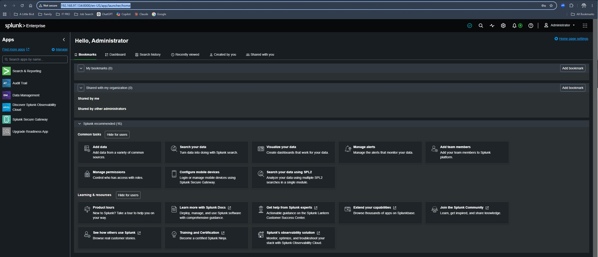
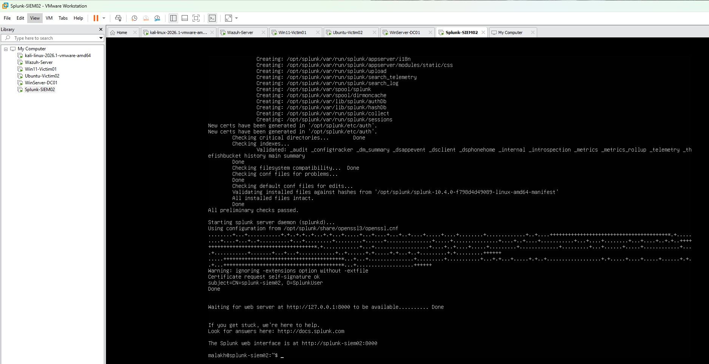
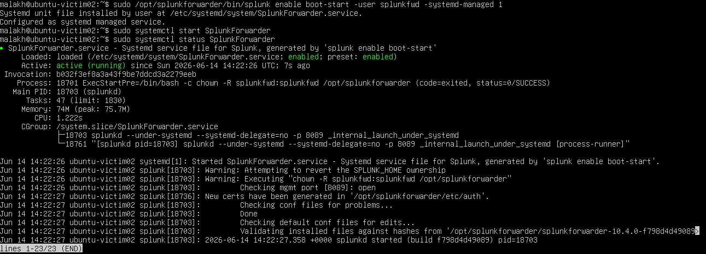
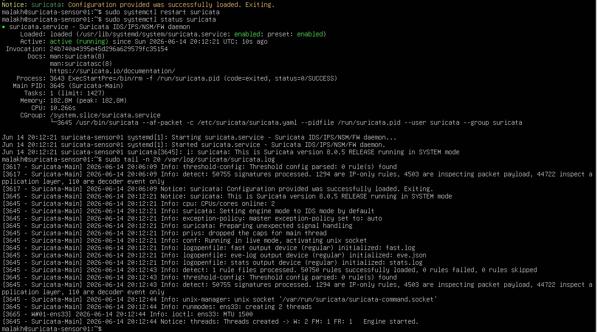

# SOC Lab Infrastructure Build-Out: 7 VMs | Dual SIEM | Network IDS | CIM Normalization

**Completed:** 2026-06-18

**Author:** Malakh Fuller

> **Privacy note:** Internal lab IP addresses have been anonymized in this writeup and related screenshots. All testing was performed exclusively on my own isolated home lab network.

> **How to read this:** This is the honest version. Where I hit a wall, took a wrong turn, or assumed something was working when it wasn't, that's in here on purpose. A writeup where everything works the first time is a writeup where nothing was actually learned. The dead ends *are* the experience — they're the part I can defend in an interview, because I lived them.

---

## Objective

Take the 5-VM Wazuh lab I'd already built and turn it into the kind of environment a real SOC actually runs: a **second SIEM** alongside the first, a **network intrusion detection sensor** watching the wire, and a **normalization layer** that makes raw sensor data speak the same field language as everything else.

Concretely, that meant four things on top of the existing foundation:

1. Stand up **Splunk Enterprise** as a second SIEM running in parallel with Wazuh — the SIEM that shows up most in job postings — and forward every endpoint into it.
2. Build a **passive Suricata IDS sensor** that sniffs the lab segment and detects network-layer attacks the endpoint agents can't see.
3. Feed that one sensor into **both** SIEMs, so Wazuh and Splunk are watching the same network detections.
4. Hand-write a **CIM (Common Information Model) mapping** so Suricata's data lands in Splunk's Intrusion Detection data model instead of sitting in an un-normalized pile — the difference between "the data is technically there" and "the data is usable."

The goal was never to follow a tutorial to a working screenshot. It was to build the instrument I'll spend the *next* project attacking, and to understand every layer well enough that when something breaks mid-investigation later, I already know where the pipe runs.

---

## Tools and Technologies

| Category | Details |
|---|---|
| **Hypervisor** | VMware Workstation Pro (Broadcom, free for personal use) |
| **SIEM #1 / XDR** | Wazuh 4.14 (Manager, Indexer, Dashboard) |
| **SIEM #2** | Splunk Enterprise 10.4.0 (Developer License, 10GB/day) |
| **Network IDS** | Suricata 8.0.x (OISF stable PPA), ET Open ruleset (~50,750 rules) |
| **Log Forwarding** | Wazuh Agent 4.14.5, Splunk Universal Forwarder 10.x |
| **AttackBox** | Kali Linux 2026.1 |
| **Victim Endpoints** | Windows 11 Enterprise (Evaluation), Ubuntu Server (LTS) |
| **Domain Controller** | Windows Server 2025 (Evaluation), AD DS for `soclab.local` |
| **Endpoint Telemetry** | Sysmon v15.20 (SwiftOnSecurity config) |
| **Normalization** | Splunk Common Information Model Add-on + hand-built `TA-suricata-cim` |
| **Skills Applied** | PowerShell, Linux CLI, Active Directory, network segmentation, log forwarding, SPL, props/transforms config, CIM data modeling |
| **Prior Knowledge** | CompTIA A+, Network+, Security+, CySA+ (in progress), prior home SOC labs |

---

## Final VM Roster

Seven VMs running concurrently on a single host (Ryzen 9 9950X / 64GB DDR5), all on the isolated `10.10.10.0/24` segment.

| VM | Role | IP | RAM | vCPU |
|---|---|---|---|---|
| Kali-AttackBox | Attack simulation | 10.10.10.128 | 4GB | 2 |
| WazuhServer-SIEM01 | SIEM #1 / XDR | 10.10.10.130 | 8GB | 4 |
| Win11-Victim01 | Windows endpoint (`DESKTOP-6H1BPIU`) | 10.10.10.131 | 6GB | 2 |
| Ubuntu-Victim02 | Linux endpoint | 10.10.10.133 | 2GB | 2 |
| WinServer-DC01 | Domain controller (`WIN-CBG93HEA6LI`) | 10.10.10.134 | 4GB | 2 |
| Splunk-SIEM02 | SIEM #2 | 10.10.10.137 | 8GB | 4 |
| Suricata-Sensor01 | Passive network IDS | 10.10.10.140 | 4GB | 2 |

---

## Network Architecture

| Network | Purpose | Subnet |
|---|---|---|
| VMnet2 | SOC internal — all VMs, fully isolated | 10.10.10.0/24 |
| VMnet8 (NAT) | Temporary internet, removed/toggled after installs | 192.168.x.x/24 |

Everything lives on the isolated `VMnet2` segment. The two infrastructure boxes that need to pull updates from the internet — Splunk and the Suricata sensor — are **deliberately dual-homed** (a second NAT adapter) rather than the whole lab being given internet. That's a conscious trade: a dual-homed box bridges the isolated network to the outside, so I kept the bridge on the SIEM/sensor (saner places to allow internet) and off the victims and the attacker box. The NAT adapters are toggleable if I want pure isolation for a given attack scenario later.

---

## The Foundation (Prior Work, Condensed)

This build sits on top of a 5-VM Wazuh lab I'd already stood up: VMware Workstation Pro, an isolated `VMnet2`, Kali, a Wazuh manager/indexer/dashboard, two domain-joined victims (Windows 11 + Ubuntu), and a Windows Server 2025 domain controller running `soclab.local` with Sysmon on the Windows boxes.

A few things from that foundation are worth carrying forward because they bit me then and inform everything here:

- **VMware custom networks don't appear in the VM adapter dropdown** until you check *"Connect a host virtual adapter to this network"* in the Virtual Network Editor. The networks exist on paper but the VMs can't select them. Pure troubleshooting to discover — it's documented nowhere obvious.
- **Linux can join a Windows AD domain** (`realmd` + `sssd` stack), but the join fails until you point the Linux box's DNS resolver at the domain controller. In a mixed-OS environment, DNS is the foundation everything else stands on.
- **Wazuh starts detecting vulnerabilities the moment an agent connects** — 13 CVEs surfaced on the Windows endpoint within minutes, zero config. And **Sysmon flags all your own admin activity as suspicious**, which was my first real lesson in false positives: the same alerts that fire on legitimate setup work will fire on a real attack, and telling them apart is the actual job.


With that foundation live, Phase 2 begins.

---

## The Build

### 1. The MDE dead end, and knowing when to resequence

The plan opened with Microsoft Defender for Endpoint: deploy it across the lab and pull its telemetry into Wazuh. I got the architecture straight first — MDE is a *cloud* EDR, so onboarded endpoints report to Microsoft's cloud, and "telemetry into Wazuh" actually means Wazuh reaching *out* to the Graph API to pull alerts back down. Fine. Then I hit gate after gate:

- No free standalone MDE — the path is a trial tied to a Microsoft 365 tenant. I created a *dedicated, lab-only* Microsoft account to keep the lab identity walled off from anything real (compartmentalization, the right habit when the environment will be generating attack telemetry).
- The trial demanded a credit card even at $0. Plan was: enter card, immediately kill auto-renew.
- The order tripped a **fraud hold (error 43881)** and the billing account came back **Disabled**. A brand-new account instantly buying enterprise security licensing looks exactly like fraud to an automated risk engine, so it got kicked to a human review on Microsoft's clock — hours to days.

So I made a call: **defer MDE, don't grind on it.** It threw two hard gates and produced zero hands-on learning, and it wasn't load-bearing for anything downstream — it was first on the list only because of how I'd ordered things. Meanwhile every other tool in the plan installs locally with none of that friction. The tenant stays parked (no charge, billing never activated) and is reusable later for Microsoft Sentinel if I go that way. The evening wasn't wasted; I stood up a tenant I can repurpose, and I pivoted to the tool recruiters actually ask about: Splunk.

That decision discipline is the same muscle as the field work I came from — you read where the resistance is, decide whether the objective actually depends on this avenue, and reroute without losing the goal. Knowing when to abandon a line of effort cleanly is its own skill.

### 2. Standing up Splunk — and a lockout that cost me an evening

I chose to run Splunk on **Ubuntu Server, headless**, not Windows and not a desktop — because in production it runs on Linux, administered over SSH, and I want my hands to match what a real shop runs. Developer License (10GB/day, no trial clock) so it's free and persistent.

Then, before I installed a single thing, the build nearly died on the dumbest possible problem: I finished the Ubuntu install, went to log in, and got **"Login incorrect"** — repeatedly, with a password I was sure of. Rather than guess, I worked it:

- Confirmed Linux hides the password field entirely as you type, so a typo is silent.
- Ruled out Caps Lock and case sensitivity.
- Ran a **keyboard-layout test** — typed the password into the *visible* username field just to see it render. It came out correct, so the keyboard mapped fine; layout wasn't the problem.
- Confirmed from the boot banner I was in the installed system, not the installer.

Conclusion: a silent typo when I *set* the password during install. The password I set wasn't the password I thought I set. I tried the proper sysadmin recovery (GRUB → root shell → `passwd`), but couldn't reliably catch the GRUB menu in the VM, and with an empty box and nothing to save, I took the pragmatic off-ramp: delete and rebuild, writing the password down *before* typing it this time. A 30-second habit that would have saved an hour. The rebuild logged in first try.

The install itself, once I was in:

- `.deb` package transferred via VMShare (headless box, no GUI to drag into — and shared folders are *per-VM* in VMware, so the host folder existing wasn't enough; I had to enable it in this VM's options and mount it by hand).
- First start refused outright: *"Running Splunk Enterprise as root is deprecated."* Instead of forcing it, I set up the proper fix **before** first start — created an unprivileged `splunk` user, `chown`'d `/opt/splunk` to it, started under `sudo -u splunk`. The reasoning: first start creates all the runtime files, and whoever creates them owns them. Doing the service account first means a clean ownership foundation and least-privilege done right — a Splunk compromise lands on a limited account, not root.
- The box is dual-homed: `ens33` (10.10.10.137, VMnet2) is the **collection** address forwarders ship to; `ens34` (NAT) is for pulling Splunkbase add-ons. Console reached from my *host* browser at `:8000` — with one false start where I pasted the URL into the VM's terminal and bash tried to run it as a command.

Splunk Enterprise live.


*The Splunk web console, reached from the host browser at `:8000` — the second SIEM is up and reachable.*

<!-- OPTIONAL (01): first-start terminal showing "The Splunk web interface is at..." —  -->

### 3. Wiring the endpoints into Splunk — three rounds of the same lesson

Getting Universal Forwarders onto all three endpoints (the DC, Win11, Ubuntu) was where I learned what real forwarder troubleshooting looks like — mostly by getting the same lesson three times until it stuck.

**The host-name lesson (bit me three times).** Every time I searched for data by the name I'd given the VM — `WinServer-DC01`, `Win11-Victim01` — I got nothing, and briefly thought the forward was broken. It wasn't. **Splunk's `host` field is the machine's real computer name, not the VMware label.** Both Windows boxes carried throwaway auto-generated names (`WIN-CBG93HEA6LI`, `DESKTOP-6H1BPIU`) that I'd never renamed. The fix each time: drop the host filter, read the `host` facet in `index=_internal`, and there the box was, already sending. `hostname` is ground truth; the VM label is a sticky note.


*Searching `index=* host=WIN-CBG93HEA6LI` — the DC's auto-generated computer name, not its VM label — returns 2,088 events. The machine was never renamed at promotion; Splunk's `host` field is the real computer name.*

**"Connected isn't sending."** On the DC, `splunk list forward-server` showed an active forward, but searches returned nothing. An active forward means the *pipe is open*, not that data is *flowing*. The forwarder was reaching Splunk (`index=_internal` proved it — thousands of the forwarder's own health logs), but the inputs that decide *what* to send weren't all configured. I diagnosed it by eliminating in order: destination (read `outputs.conf` directly) → connection (`_internal` events) → inputs (`inputs.conf`). Each check kills a branch instead of guessing.


*Verifying below the UI: `ss -tlnp | grep 9997` shows `splunkd` listening on `0.0.0.0:9997` — open on all interfaces, so forwarders on VMnet2 can reach it. The dashboard says "saved"; the OS confirms "actually listening." Two different things.*

<!-- OPTIONAL (03): the Splunk UI "Receive data" page confirming port 9997 enabled —  -->

**Sysmon needs a manual input.** The install wizard configures standard Windows Event Logs but never picks up Sysmon — it writes to its own dedicated channel. I added the stanza by hand to `inputs.conf` with `renderXml = true` (the format the supported add-on parses cleanly), and verified the file landed at the right path with `Get-Content` so Notepad couldn't sneak a `.txt` on the end.


*243 Sysmon events from the DC, parsed by the add-on into the fields that matter for detection — `CommandLine`, `Image`, `ParentImage`, `Hashes`, `IMPHASH`, `IntegrityLevel`. This is the deep endpoint telemetry that makes detection work possible.*

**Protected vs. normal log channels.** On Win11, Application and System logs flowed but Security and Sysmon didn't. The tell: those two are *protected* channels, and the forwarder was running under a restricted virtual account that can read normal logs but not protected ones. I switched the service to **LocalSystem** and they appeared. (Production note: the least-privilege route is adding the service account to the *Event Log Readers* group rather than granting full LocalSystem.)

**Front-loading the lesson.** By the time I got to the Ubuntu endpoint, the whole point was to *apply* what Win11 taught me instead of rediscovering it. Linux has the same protected-log problem with a different mechanism — `auth.log` and `syslog` are readable by `root` and the `adm` group. So *before* first start I created a dedicated `splunkfwd` user, `chown`'d the forwarder directory to it, and added it to `adm`. Data flowed on first start, no debugging. That single up-front step *was* the entire Win11 debugging session, collapsed into one line. That's the whole reason I keep these notes.

I also installed the parsing add-ons (**Splunk Add-on for Microsoft Windows**, **Splunk Add-on for Sysmon** — the Splunk-supported one, not the archived community look-alike with the nearly identical name), kept the DC **single-homed** (multi-homing a domain controller risks DNS registration conflicts that can break AD resolution), and registered Splunk for **boot-start as the `splunk` service account** — then actually rebooted to confirm it came back on its own, rather than trusting the config. Behavior verified, not just configured.

All three endpoints now feed **both** SIEMs. The endpoint layer of the dual-SIEM is complete.

<!-- OPTIONAL (05): Splunkbase add-ons installed (Sysmon 5.0.0 + Microsoft Windows 10.0.1, both Global/Enabled) —  -->
<!-- OPTIONAL (08): Splunk indexer boot-start (systemctl status Splunkd, enabled + active, owned by splunk) —  -->
<!-- OPTIONAL (09): Ubuntu forwarder boot-start, showing the splunkfwd least-privilege account —  — promote this one to a live image if your audience is hands-on SOC managers; it shows least-privilege + persistence in one frame -->

### 4. A passive sensor on the wire — proving the wire before trusting it

The hard part of adding Suricata was never going to be installing it; it's a package, it installs. The hard part was the question I spent twenty years asking about human sources and was now asking about a network interface: *can this thing even see what I need it to see?* Positioning is the whole game. A sensor wired to the wrong spot is an expensive way to watch your own reflection. So I didn't start with the tool. I started with the wire.

**Passive, not inline.** Two ways to put an IDS in a lab. *Inline* sits in the traffic path — every packet physically passes through it, so it can block (that's IPS), but it becomes a single point of failure and would mean re-plumbing my whole flat segment. *Passive* sits off to the side inspecting a *copy* of the traffic — it can see and alert but not stop. I went passive: it bolts onto the lab I already have without disturbing anything, and if it dies the lab keeps running and I just lose visibility. For a detection-focused build that's the right trade. (Honest read: passive is also the forgiving choice for someone still learning, and I'll take forgiving.)

**Proving the wire (this is the whole session).** A passive sensor's entire premise is that it can see conversations it isn't part of. That depends on two things being true at once: the NIC in promiscuous mode, and the VMware virtual switch flooding traffic to that port. Before Suricata was even configured, I made it *prove* it:

```
sudo tcpdump -i ens33 -n 'icmp and not host 10.10.10.140'
```

That filter is deliberate — ICMP only, and explicitly *not* anything to or from the sensor itself, so anything that appears is by definition a conversation between two *other* machines I have no business overhearing. Then from Kali I pinged the Splunk box, and there it was on the sensor: ICMP between two hosts that aren't me. Proof. The vSwitch is flooding unicast to my promiscuous port — the software equivalent of a SPAN/mirror port on physical gear, handed over for free.

One honest stumble: my *first* ping test targeted a box that turned out to be powered off, got nothing, and for a second I thought the sensor was broken. It wasn't — "host unreachable" was an ARP failure (the target never answered), not a sniffing failure. The lesson is the old one in new clothes: **when collection comes up empty, confirm the source was actually transmitting before you tear apart the collector.**

**The two config lines that count.** Pulled Suricata from the OISF stable PPA to get 8.0.x, backed up the config, and made two edits that did the real work:

- **`HOME_NET = [10.10.10.0/24]`** — how Suricata knows "inside" from "outside." A huge number of rules are directional (external host probing internal = attack; the reverse may be nothing). Get HOME_NET wrong and the directional logic is wrong and rules silently misfire. Defining "us" correctly is the whole foundation. (You can't model a threat to an organization until you've correctly drawn the boundary of the organization.)
- **af-packet interface `eth0` → `ens33`** — the default sniffs an interface name that doesn't exist on modern Ubuntu. Point it at the NIC I'd *verified* sees traffic.

`suricata-update` pulled the ET Open ruleset (**50,750 rules, 0 failed**), and `suricata -T` came back clean — meaning all 50k rules parsed and the config is sane *before* committing to a live run.


*Suricata `active (running)` on `af-packet`/`ens33` as an unprivileged `suricata` user — version 8.0.5, 50,750 rules loaded, 0 failed, "Engine started."*

**First blood.** Started the service (unprivileged `suricata` user, boot-start on), then poked it on purpose from Kali: `nmap -A -Pn` against the DC. `fast.log` lit up — **ET SCAN Possible Nmap User-Agent Observed**, Kali → the DC's WinRM port, caught red-handed. The full chain proven end-to-end: attack leaves Kali → crosses VMnet2 → `ens33` sees the copy → Suricata matches → alert written. Every link mine, verified, not assumed.


*First blood: `fast.log` catches the scan — ET SCAN Possible Nmap User-Agent Observed, `10.10.10.128` (Kali) → `10.10.10.134:5985` (the DC's WinRM port), Priority 1. The sensor saw a conversation it wasn't part of and named the tool that made it.*

The caveat I want to stay honest about: `-A` tripped that signature *because* it's loud — it waves an nmap user-agent string around. A patient operator who slowed down wouldn't trip that rule at all. Signatures catch the loud and the lazy; the quiet professional is a behavioral problem you find by what's anomalous over time, not by a string match. That's the detection I actually care about building later — and it's the same instinct as the source work: the careful adversary doesn't show up in any single document, he shows up in the pattern.

**The permission lesson, carved into the wall.** Shipping Suricata to Splunk meant a fourth forwarder install, and I front-loaded the permission fix this time: added `splunkfwd` to the `suricata` group. Here's the part worth keeping — `eve.json` itself is `644`, world-readable, so on paper anyone can read it. But the *directory* it lives in is `770`. **You can't read a file inside a directory you're not allowed to traverse.** The directory is the real gate, not the file. World-readable means nothing if you can't walk in the door.

<!-- OPTIONAL (12): Suricata's Splunk forwarder boot-start (systemctl status, enabled + active, splunkfwd account) —  -->

**The time-vs-time gotcha.** Suricata's events landed in Splunk and auto-extracted into fields, but a search for the nmap detections returned *zero* — which made no sense, because I'd just watched them fire. The trap: **event time vs. index time.** Splunk timestamps each event by when *Suricata logged it*, not when it arrived. The scan had happened earlier, so the events landed at their *original* time, outside my "last 60 minutes" window. The data was never missing — I was standing in the wrong moment. Widened the range and 37 detections appeared, fully parsed. The reflex to keep: an empty SIEM search when you *know* the event happened means **check your time range first.**

### 5. Two SIEMs, one sensor — and a dead pipe I had to take apart

The sensor was feeding Splunk. I wanted it feeding Wazuh too, so both tools watch the same network detections. One sensor, two sets of eyes. On paper, trivial — all three endpoints already did this. Most of this session was me staring at an empty screen wondering why the thing I'd just "finished" was doing nothing.

I did the boring check first this time (burned by an assumption the night before): pinged the manager, poked the two ports the agent needs — **1515** (first handshake, gets issued a key) and **1514** (ships events after). All open. The Wazuh dashboard generated a version-pinned install command (a mismatched agent and manager is a classic way to create a problem you'll never think to look for later), and the agent enrolled clean — agent 004, *Active*.


*The Wazuh fleet, now four agents: the two Windows boxes, the Ubuntu endpoint (`10.10.10.133`), and the Suricata sensor as 004 (`10.10.10.140`) — all `active`, all on 4.14.5. The sensor joined the same SIEM the endpoints already report to.*

One thing in the startup log nearly gave me a heart attack: right after "Connected to the server," a wall of `SIGNAL [(15)-(Terminated)]` and `Shutdown received` lines that read like the agent face-planting on arrival. It wasn't. The line *above* was the tell — *"Agent is reloading due to shared configuration changes."* The moment it connected, the manager pushed its central config and the agent restarted its internals to apply it. A reboot, not a death. **Read the line above the scary part before you panic.**

Then I pointed the agent at `eve.json`, dropped the `wazuh` user into the `suricata` group (same door-traversal gate as the Splunk side), confirmed the group took, and felt good about myself. Fired a test nmap from Kali. Came back to the manager.

Nothing. Ran it again. Still nothing.

This is the part I'm actually proud of — not because I fixed it fast (I didn't), but because of *how*. An empty screen after a test isn't a failure, it's a clue: the alert died somewhere on the four-hop trip from Kali to that log file, and the job is finding *which* hop. I have exactly one skill from a former life that transfers cleanly here: take a broken chain apart one link at a time, and don't trust a single link you haven't personally checked. So I walked it from the source out.

- **Was Suricata even detecting?** Checked its own log — fresh `ET SCAN` hits stamped seconds ago. The sensor was fine. Break is downstream.
- **Was the agent reading the file?** Grepped the agent's log for `eve.json`. Empty. *Completely* empty.

And here's the reasoning that separates guessing from knowing: the grep came back empty **with no error in it either.** If this were the permission wall again, the agent would have *tried* to open the file, failed, and logged an angry line with that path — which my grep would've caught. Total silence meant the agent wasn't even *trying*. It had never been told to. So this wasn't permissions. It was config.

I looked at the config file. The block was *right there*, perfectly formed. The agent just hadn't read it — because **editing a config file and getting the running service to load that edit are two completely separate actions.** I'd done the first and quietly assumed it counted as the second. The service reads its config when it *starts*. I restarted the agent, grepped once more, and there it finally was: `wazuh-logcollector: Analyzing file: '/var/log/suricata/eve.json'`.

One last trap: a freshly-started log collector reads from the *current end* and follows forward, so my earlier alerts were behind its read line and would never replay. I needed a *brand-new* scan — and rather than try to catch an alert scrolling past in a live feed (which I'd already proven I'm bad at), I fired a fresh nmap and just *searched* the alert log directly. A static search can't be missed by bad timing:

```
Rule: 86601 (level 3) -> 'Suricata: Alert - ET SCAN Possible Nmap User-Agent Observed'
```

There it was. Wazuh's own built-in Suricata rule firing on my sensor's detection with no custom rule-writing from me — fully decoded, Kali to the DC's WinRM port, the nmap user-agent sitting in the data confessing. The same detection now living in *both* SIEMs. The sensor finally had two sets of eyes.


*The same detection, now in the second SIEM. A static `grep` of the manager's alert log finds Wazuh rule 86601 — "Suricata: Alert - ET SCAN Possible Nmap User-Agent Observed" — fully decoded, Kali → the DC's WinRM port, the nmap user-agent string sitting right there in the event. No custom rule-writing required; Wazuh ships the Suricata decoders built in.*

The install was easy and I've half-forgotten it already. Chasing the dead pipe back to the one line that mattered is the part that stuck.

### 6. Making Suricata speak CIM — the hand-rolled normalization layer

At this point Suricata's alerts were searchable in Splunk, but they were *un-normalized*: living in `index=main` as `sourcetype=suricata:json`, with Suricata's own field names. Searchable isn't the same as *usable*. Splunk's apps, dashboards, and correlation searches expect the **Common Information Model** — a shared field vocabulary (`src`, `dest`, `signature`, `severity`, `action`) so a search can ask "show me all intrusion detections" without caring which vendor produced them. Out of the box, Suricata wasn't in the Intrusion Detection data model at all.

**The decision: hand-write the mapping (Path B).** There's a vendor TA on Splunkbase that would've done this for me. I chose to build the mapping myself instead — partly to actually understand CIM rather than installing a black box, partly because "I hand-mapped a sensor into the CIM data model" is a far stronger thing to say in an interview than "I installed an add-on." I built `/opt/splunk/etc/apps/TA-suricata-cim/` as the `splunk` user, with:

- **`props.conf`** — the real work. `FIELDALIAS` to rename `src_ip`→`src`, `dest_ip`→`dest`, `host`→`dvc`. `EVAL` statements to pull `signature`/`category`/`signature_id`/`action` out of the nested `alert.*` fields. And a `severity` mapping that had a catch: **Suricata's severity scale is inverted and numeric** — `1` is *most* severe — so I wrote a case statement translating `1`→`high`, `2`→`medium`, `3`→`low` to match CIM's expected string values.
- **`eventtypes.conf` + `tags.conf`** — defined an eventtype (`suricata_attack`) and tagged it `ids` + `attack`, which is literally how the data model finds these events.
- **`metadata/default.meta`** — with `export = system`. This one mattered more than it looks: the data model runs in a *different app context*, so without a global export it can't see my objects at all.

I verified the CIM spec live rather than from memory — fetched Splunk's own Intrusion Detection data model docs to confirm the dataset name (`IDS_Attacks`), the required tags, and the prescribed field values (`action` = allowed/blocked, `severity` = critical/high/medium/low/informational, `transport` lowercase). Building to a remembered spec is how you build something that's subtly wrong.

**The gut-punch.** Restarted, ran the check — `| datamodel Intrusion_Detection IDS_Attacks search` — and got **"data model not found."** Not "no results." *Not found.* My first instinct was that I'd broken my add-on. So I split the question in two: was it my *field mapping* that failed, or the *data model* itself? A flat search proved my props were working perfectly — every CIM field was populating correctly. So the mapping was fine. The data model itself didn't exist.

Root cause: the **Splunk Common Information Model Add-on** — the base package that *defines* all the CIM data models — **wasn't installed.** I'd assumed (from an earlier note) that it shipped with Splunk Enterprise. It doesn't; bare Enterprise doesn't bundle it. The live "not found" error overturned an assumption I'd carried in from a prior session. **Prior-session state has to be verified against current reality**, every time. I installed the CIM add-on from Splunkbase, restarted, and reran the check.

**Final verification:**

```
| datamodel Intrusion_Detection IDS_Attacks search | stats count
```

**104 events.** And a flat search now showed the data-model-generated fields (`is_Network_IDS_Attacks` and friends) attached to my Suricata events — the model *claiming* them as its own. Suricata is now a first-class CIM citizen in Splunk: any CIM-aware search, dashboard, or correlation rule sees its detections automatically, no special-casing. That's the difference between data being present and data being usable.


*The payoff: `| datamodel Intrusion_Detection IDS_Attacks flat` returns Suricata events carrying the data-model-generated fields (`is_Network_IDS_Attacks` and its siblings), alongside the normalized `src`/`dest`/`signature`/`severity`/`action`. The Intrusion Detection model now claims the sensor's detections as its own — fully normalized, no special-casing.*

---

## Final Lab State

| VM | IP | Wazuh (SIEM #1) | Splunk (SIEM #2) | Sysmon | Domain |
|---|---|---|---|---|---|
| Kali-AttackBox | 10.10.10.128 | — | — | — | No |
| WazuhServer-SIEM01 | 10.10.10.130 | *(self)* | — | — | No |
| Win11-Victim01 | 10.10.10.131 | Agent | UF (WinEventLog + Sysmon) | Yes | soclab.local |
| Ubuntu-Victim02 | 10.10.10.133 | Agent | UF (auth.log + syslog) | — | soclab.local |
| WinServer-DC01 | 10.10.10.134 | Agent | UF (WinEventLog + Sysmon) | Yes | soclab.local |
| Splunk-SIEM02 | 10.10.10.137 | — | *(self)* | — | No |
| Suricata-Sensor01 | 10.10.10.140 | Agent (rule 86601) | UF (`suricata:json` → CIM) | — | No |

**The result:** three endpoints and one network sensor feeding two independent SIEMs, with the sensor's network detections normalized into Splunk's Intrusion Detection data model. Every layer — endpoint, network, normalization — verified end-to-end with a real detection, not assumed from a green status light.

---

## Key Lessons (the transferable kind)

These are the ones I'll carry into a real SOC, because each cost me something to learn.

1. **A config edit and a service reload are two different actions.** The single most expensive lesson here. The service reads its config at *start*. Editing the file changes nothing until something reloads it. Half the "but I configured it!" problems in this field are really "you configured it and never made anything reload it."
2. **When a test comes back empty, don't guess — walk the chain from the source out.** Confirm the thing at the *start* actually fired before blaming anything downstream. Each verified link kills a branch of the search.
3. **The absence of an error is information.** "Empty, and not even complaining" told me the Wazuh agent wasn't *trying* to read the file — which meant config, not permissions, and pointed straight at the fix.
4. **Connected ≠ sending.** An open forward only means the pipe exists. Inputs decide whether data flows.
5. **The host field is the real computer name, not the VM label.** Bit me three times before it stuck. Empty search? Drop the host filter, read the facet.
6. **Prove the wire before you trust it.** One tcpdump command, run before I built anything, was the foundation the entire Suricata build stood on. Verify access, then bank on the take.
7. **The directory is the gate, not the file.** A world-readable file inside a `770` directory is unreadable to anyone who can't traverse the directory. Permissions are a path, not a single checkpoint.
8. **Event time vs. index time.** An empty SIEM search for an event you *know* happened — check your time range first. Nine times out of ten the data's there and you're looking at the wrong slice of the clock.
9. **Front-load the lesson.** The Win11 permission debugging session became a one-line setup step on the Ubuntu box. That's the entire payoff of writing things down as you go.
10. **Verify prior-session assumptions against live reality.** "Splunk_SA_CIM is installed" was true in my notes and false on the box. The live error wins, every time.

---

## Key Competencies Demonstrated

- Dual-SIEM architecture (Wazuh + Splunk running in parallel against identical telemetry)
- Splunk Enterprise deployment, least-privilege service account, systemd boot-start, receiver configuration
- Universal Forwarder deployment across Windows and Linux, diagnosed and fixed entirely from config files
- Protected vs. normal log-channel access (Windows service accounts; Linux group membership)
- Passive network IDS deployment (Suricata) with verified promiscuous-mode visibility
- Network sensor integrated into two SIEMs from a single source
- **Hand-built CIM normalization** — `props.conf` field aliasing and EVAL mapping, eventtype/tag definition, cross-app metadata export, validated against the live CIM spec
- Methodical, source-out troubleshooting of multi-hop data pipelines
- Snapshot discipline and honest, continuous documentation throughout

---

## Employer-Relevant Skills

**Tools:** Splunk Enterprise (SPL, props/transforms, CIM, data models), Wazuh, Suricata, Sysmon, Universal Forwarder, VMware Workstation Pro, PowerShell, Linux CLI, Active Directory

**Concepts:** dual-SIEM design, network IDS positioning (passive vs. inline), log forwarding and parsing, CIM normalization and data modeling, least-privilege service accounts, network segmentation, false-positive triage, pipeline troubleshooting

**Frameworks:** MITRE ATT&CK (referenced for the upcoming attack-simulation project), Splunk Common Information Model

---

## SOC Relevance

This is the instrument a Tier 1/Tier 2 analyst actually works inside: multiple detection sources (endpoint agents, a network sensor) feeding SIEMs, with a normalization layer that lets one query span every source. The hands-on parts — watching alerts fire in real time, telling admin noise from genuine signal, and *especially* tracing why data isn't where you expect it — are the daily reality of the job. When a SIEM search comes back empty mid-incident, the analyst who already knows the difference between event time and index time, or between "connected" and "sending," resolves it in minutes instead of escalating it. I built the pipeline, so I know where every pipe runs.

---

## HUMINT to SOC Translation

The throughline of this entire build was a single instinct from twenty years of source work: **verify access before you trust the take.** It showed up as the tcpdump that proved the sensor could see before I built on it, as walking the dead Wazuh pipe one link at a time, as confirming a forwarder was *sending* and not just *connected*, and as checking the live CIM spec instead of trusting my own notes.

The other transfer was decision discipline — deferring MDE cleanly the moment it stopped being load-bearing, instead of grinding on a blocked avenue out of commitment. Knowing when to reroute without losing the objective is the same muscle in elicitation and in lab-building. And the detection philosophy I keep circling — that signatures catch the loud and the lazy, while the careful adversary only shows up in the *pattern over time* — is exactly how you run a source you can't catch in any single meeting. The tooling is new. The way of thinking is not, and it's the part that doesn't show up on a certificate.

---

## What's Next

The infrastructure is built and verified. The next project puts it to work — moving from "I built the instrument" to "I used it."

The immediate next step is populating Active Directory for realistic attacks: creating test users and at least one **Kerberoastable service account** (an SPN-registered account with a deliberately weak password — a vanilla domain has nothing to roast), then confirming the DC's audit policy actually generates the telemetry the attacks should produce (4625 for password spray, 4768/4769 for Kerberos activity). From there, with a pre-attack snapshot taken, the work becomes adversarial:

- **Password spray** (MITRE T1110.003) — detected across both SIEMs
- **Kerberoasting** (MITRE T1558.003) — 4769 detection, with logic written in both Wazuh and SPL
- **Lateral movement** detection, including live endpoint hunting
- **Custom detection rule writing** — authoring and tuning detections in both platforms
- **Full purple-team capstone** — end-to-end attack chain with post-incident forensic investigation and a complete incident report drawing on every telemetry source in this build

That's a separate project, and it's where this lab stops being a thing I built and starts being a thing I can *defend* — attack by attack, detection by detection.

---

## Author

[Malakh Fuller](https://www.linkedin.com/in/malakhfuller/) · [GitHub](https://github.com/MalakhFuller)
